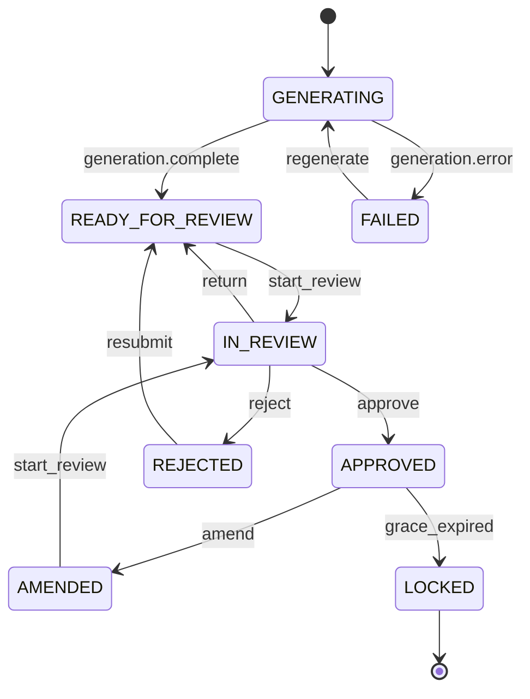

# Soulside AI Clinical Notes

Soulside AI turns recorded therapy sessions into structured SOAP notes. This repository is the review product, where clinicians claim generated notes, correct the clinical content, and move each note through a controlled lifecycle until it is approved and locked.

Three product realities drive most of the engineering decisions:

- **Clinical text must never be lost silently.** A dropped edit is a patient safety problem, not a UX annoyance.
- **Reviewers collide.** Several people work the same queue, so two of them will open the same note within the same minute.
- **Clinic networks are unreliable.** The app has to stay useful when the connection drops mid sentence and recover cleanly when it returns.

## Running locally

```bash
pnpm install
pnpm dev
```

- Client runs at [http://localhost:5173](http://localhost:5173), API at [http://localhost:3001](http://localhost:3001), proxied through the client at `/api`.
- The API seeds 100,000 notes on boot so list and subscription behaviour are exercised at real scale. Use `SEED_COUNT=500` for a faster start.
- Seeding is deterministic via `SEED`, so the same count and seed always produce the same data and bug reports reproduce.
- Fault injection is on by default: 100 to 800 ms latency, roughly 5 percent of requests fail with a 500, and roughly 2 percent of saves are forced into a conflict.
- Set `CHAOS=0` for a calm environment during a walkthrough or recording.

**Tradeoff:** leaving chaos on by default makes recovery paths visible during everyday development, at the cost of the occasional failed click.

| Command | What it does |
|---|---|
| `pnpm dev` | Runs the client and the API together |
| `pnpm test` | Vitest suites for the domain package and client modules |
| `pnpm simulate` | Drives the API with concurrent reviewers and edge case scenarios |
| `pnpm simulate:scenarios` | Runs only the edge case scenarios, which is much faster |
| `pnpm test:e2e` | Playwright browser tests, booting the API and client if needed |
| `pnpm typecheck` | Type checks every package |

The simulation needs a running API, so start with `pnpm dev` or `pnpm dev:api` first.

## How the code is organised

| Package | Responsibility |
|---|---|
| `apps/web` | React single page application built with Vite |
| `apps/api` | Mock REST and WebSocket backend built with Hono, plus the in memory store |
| `packages/domain` | Shared types and the note lifecycle machine, no framework dependencies |
| `simulate_workflow.ts` | Concurrency and edge case driver for the API |

The client follows Feature Sliced Design, and layers may only import downward.

```
apps/web/src/
  app/       providers, routing, global styles, application shell
  pages/     routable screens
  widgets/   composite blocks such as the note workspace
  features/  capabilities such as autosave, offline queue, conflict resolution
  entities/  business entities such as note and user
  shared/    api client, database, realtime client, telemetry, logging, ui kit
```

- Each capability owns its model and its UI, so changing save debouncing does not touch the note entity or the page.
- The lifecycle machine lives in `packages/domain` and both hosts import it. The client decides which buttons exist, the server rejects illegal requests.
- Useful comparison: the machine plays the role of React with pure rules and no side effects, while the client and API are the renderers that apply those rules to a browser and to HTTP.
- **Tradeoff:** more directories than a small app needs, plus occasional friction when a feature genuinely spans two slices.

## The note lifecycle

Status determines both which actions are offered and whether the clinical text can be edited.

| Status | Meaning | SOAP editable by |
|---|---|---|
| `GENERATING` | The model is drafting the note | Nobody, locked while generating |
| `READY_FOR_REVIEW` | Waiting in the queue for a reviewer | Nobody until a reviewer claims it |
| `IN_REVIEW` | A reviewer has claimed it and is working | The assigned reviewer, or any admin |
| `REJECTED` | Sent back by a reviewer with a reason | The clinician who owns the note |
| `AMENDED` | An approved note reopened inside the grace window | The clinician who owns the note |
| `APPROVED` | Signed off, waiting out the amendment window | Nobody, amend to reopen |
| `LOCKED` | The 24 hour amendment window has passed | Nobody, a new note is required |
| `FAILED` | Generation failed | Nobody, regenerate instead |



### Transitions

Every legal edge is one row in the transition table and is defined nowhere else. Automatic transitions are system triggered and never rendered as buttons.

| Action | From | To | Who may trigger it | Guards and effects |
|---|---|---|---|---|
| `generation.complete` | `GENERATING` | `READY_FOR_REVIEW` | System | Fires when the generation worker finishes |
| `generation.error` | `GENERATING` | `FAILED` | System | Fires when generation fails |
| `regenerate` | `FAILED` | `GENERATING` | Clinician or admin | Queues a fresh generation run |
| `start_review` | `READY_FOR_REVIEW` | `IN_REVIEW` | Reviewer or admin | Assigns the caller as reviewer, which is how claims race safely |
| `return` | `IN_REVIEW` | `READY_FOR_REVIEW` | Assigned reviewer, or any admin | Releases the assignment back to the queue |
| `approve` | `IN_REVIEW` | `APPROVED` | Assigned reviewer with a fresh auth step, or any admin | Records approval time and releases the reviewer. Admins skip re authentication |
| `reject` | `IN_REVIEW` | `REJECTED` | Assigned reviewer, or any admin | A written reason is required, assignment is released |
| `resubmit` | `REJECTED` | `READY_FOR_REVIEW` | Clinician or admin | Requires a new version, so nothing returns unchanged |
| `amend` | `APPROVED` | `AMENDED` | Clinician or admin, within 24 hours of approval | Requires a new version and clears the approval timestamp |
| `grace_expired` | `APPROVED` | `LOCKED` | System | Runs once the 24 hour window elapses. The server may force it |
| `start_review` | `AMENDED` | `IN_REVIEW` | Reviewer or admin | Assigns the caller as reviewer, as with a first review |

### Administrator break-glass

Supervision needs an escape hatch, because reviewers go off shift with notes still claimed.

- Admins act on notes claimed by someone else, so return, reject, and approve all work without holding the assignment.
- Approval does not ask an admin for the extra authentication step a reviewer must complete.
- Admins can edit the clinical text of a note in review even when another reviewer owns it. This is the part most likely to surprise a new reader.
- Admins also hold the clinician side actions: regenerate, resubmit, and amend.
- Still enforced: the lifecycle itself, so no jumping from generating to approved, and the 24 hour amendment window.
- **Tradeoff:** break-glass is powerful and easy to misuse. Production needs an audit trail recording every override with the acting identity and a reason. The review timeline already records who moved a note and when, which is the foundation for that.

## Where state lives

State is split by who owns it and how long it should survive, not by which component reads it.

| Layer | Owns | Deliberately does not own |
|---|---|---|
| URL search parameters | Filters, sort, search text, open note id | Any note content |
| Zustand stores | Session actor and token, SOAP drafts, selection, conflict modal, connectivity, presence | Server note entities |
| TanStack Query | Notes, versions, review events from the server | Individual keystrokes |
| Dexie in IndexedDB | Queued mutations and parked telemetry batches | A full offline replica of notes |
| Domain machine | Which lifecycle edges are legal and why | Persistence or transport |
| Telemetry buffer and socket client | Event batching and live fan in | Authoritative note status |

- Filters in the URL mean a reviewer can share a link to a filtered queue and the back button behaves as expected.
- Drafts stay out of the query cache so a background refetch can never discard in progress edits.
- IndexedDB stores intent rather than data, which keeps the offline story small.
- **Tradeoff:** a note never opened while online is not available offline.

## Saving, autosave, and conflicts

- Each SOAP section is dirty tracked separately, so the UI shows exactly which parts have unsaved work.
- Typing schedules a save after roughly 800 ms of quiet.
- At most one request is in flight per note with at most one queued follow up, collapsing a burst of typing into a few writes.
- Saves are optimistic, because freezing the editor for hundreds of milliseconds on every pause feels broken.
- Transient rejections restore the pre save snapshot and surface a message, so rollback is visible rather than silent.
- Every write carries the version it was based on. A stale base returns a conflict containing the server head and the common ancestor.
- The three way merge lets the reviewer choose per section between their text, the server text, and the ancestor, with word level highlighting. Resolving retargets the save onto the current head.
- **Tradeoff:** last write wins would have been far less code, and it was rejected because silently losing an assessment is the worst failure this product can have.

Two races get explicit handling because both looked like data loss in testing:

- **Slow save while typing continues.** The acknowledgement advances the saved baseline to exactly what the server stored, keeps the newer text in the editor, and leaves it marked unsaved, so an in flight write cannot overwrite later words.
- **Live event arriving before its own HTTP response.** The client recognises its own echo and reconciles quietly instead of raising a conflict against the reviewer's own work.
- Every mutation carries a client generated id the server remembers, so retries, queue drains, and double clicks cannot duplicate versions or transitions.

## Working offline

- Reads come from the query cache, retained for 35 minutes, so notes already opened stay available.
- A note never loaded shows a clear explanation instead of a misleading not found page.
- Writes become durable intent in IndexedDB, covering both content saves and lifecycle transitions.
- Pending content saves for the same note are collapsed, so a long offline session does not replay dozens of intermediate revisions.
- Connectivity is reported by a banner and a header badge rather than a modal, because interrupting a clinician mid note is worse.
- On reconnect the queue drains in order. Conflicts and refused saves open the same merge UI used online, so offline work is recovered through a familiar path.
- A queued claim that someone else already took is dropped with an explanation and the rest of the queue continues, rather than blocking behind a request that can never succeed.
- Failures that look transient stay queued for a later attempt.
- **Known limit:** queued clinical text sits unencrypted in IndexedDB. A shared clinical workstation needs encryption at rest and a retention policy.

## Live collaboration

- One WebSocket per tab carries status changes, new versions, and presence.
- Subscriptions are scoped to the rows currently rendered plus the open note, because fanning out 100,000 notes to every client is wasteful and pointless.
- Delivery is treated as at least once. Each event carries an id, the client remembers what it applied, and repeats are dropped. That memory is capped so long sessions cannot grow without bound.
- Reconnect uses exponential backoff with jitter and resubscribes with the last processed event id, so a brief outage replays what was missed instead of leaving the screen stale.
- HTTP responses and live events may arrive in either order, so both paths are idempotent.
- A colleague's save on a note with no local edits updates the editor and tells the reviewer what happened, because content changing silently under the cursor is alarming. With local edits present, the merge UI opens instead.
- Scrolling a note out of view unsubscribes from its events but does not drop presence, since scrolling a list is not leaving the note you have open.

## Roles and authorization

- **Clinician** owns generated notes and can regenerate, resubmit, and amend them.
- **Reviewer** works the queue, claiming notes and approving or rejecting them.
- **Admin** holds both sets plus the break-glass powers above.
- **Read only auditor** sees everything and changes nothing.

Enforcement sits at four levels because each solves a different problem:

- **Transport.** Note routes require a bearer token and take identity from verified claims, so a request body cannot assert a different user.
- **Route.** Tools a role cannot use are refused with an explanation, so a denied auditor sees a message rather than an empty page.
- **Navigation.** Unavailable destinations are marked with a reason on hover.
- **Action.** Buttons are disabled with the specific reason from the lifecycle machine, such as not being the assigned reviewer, rather than hidden.

**Tradeoff:** identity here is a stand in. Signing in as a seeded user mints a short lived signed token without a password, and the pre approval confirmation replaces real multi factor auth. The shape is production accurate, since the server trusts only claims and client guards are for UX, so swapping token minting for OIDC with HTTP only cookies would not change the model.

## Scale and performance

- The queue is a virtualised infinite query over cursor pagination with a sliding window of pages, so the browser holds bounded rows and bounded data however far the reviewer scrolls.
- Sorting is stable, using the chosen column plus the note id as a fixed tie break, which stops rows swapping places as pages load.
- Version content is fetched only when a revision is opened rather than shipped with the note.
- **Code splitting.** Every screen is lazily loaded, so opening the queue does not pay for the note workspace, admin tools, or API lab.
- **Deferred features.** Heavier off path features such as the telemetry panel are also lazy.
- **One deliberate exception.** The conflict merge host stays in the main bundle, because a lazy chunk cannot be fetched at the moment it is needed most, which is when a queued offline save returns as a conflict.
- Render work is reduced structurally rather than by scattering memoisation: off screen rows unmount, selectors are narrow, empty sentinels keep object identity stable, and autosave coalescing keeps the network quiet.

React Compiler stance:

- Not enabled today. The project runs React 19 with the standard Vite plugin.
- The expensive problems at this scale are network fan out and DOM size rather than component memoisation, so the structural work above matters more.
- Enabling it later is small: add the compiler plugin to the Vite React setup, turn on the matching lint rules to catch unsupported patterns, and rerun the browser suite.
- Expected payoff is removing hand written memoisation in the table and editor rather than a large change in list performance, which is why it is a future step and not a dependency.

## Observability

- All instrumentation goes through one function so it cannot drift across the codebase.
- Events batch by size, by a short timer, on route change, and when the page is hidden or unloaded, so navigating away does not discard what just happened.
- Unload uses the beacon API with a keep alive fetch as fallback.
- Delivery retries with exponential backoff. A batch that still fails is parked in IndexedDB rather than dropped, and going online replays parked batches after resetting attempt counters.
- Sensitive fields are stripped when an event is queued and again when it is sent, so a batch parked before a redaction rule changed cannot leak clinical text later.
- The API independently rejects payloads with content shaped keys, which is defence in depth rather than trust in the client.
- A correlation id travels the whole path: out on the request, back on the response, attached to the resulting live event, and included in logs and telemetry. Tracing one save across client, server, and socket is a single search.
- Errors surface as something actionable, such as a restored draft, a merge UI, or a queued write notice. Error boundaries are nested so one failing panel does not take down the screen.

## Accessibility

- Target is WCAG 2.2 AA on the paths reviewers use constantly.
- Navigation and the identity switcher are labelled controls inside landmarks.
- Filters and the table use native controls, and row checkboxes carry real label text rather than relying on the surrounding column.
- Each SOAP section has its own label.
- Disabled actions expose the machine's reason through a title, so users learn why approval is unavailable instead of finding a dead button.
- Dialogs are marked as dialogs with labelled titles.
- **Known gaps:** no automated accessibility suite in CI, focus containment in the merge dialog is lighter than it should be, and live region announcements for status and presence are minimal.

## Keyboard shortcuts

Primary actions show their key on the button, and the header help dialog lists everything.

| Keys | Action |
|---|---|
| `?` | Open the shortcut help |
| `R`, `A`, `M`, `X`, `E` | Start review, approve, amend, reject, return |
| `Shift+G` | Request regeneration for failed notes |
| `Ctrl+S/O/A/P` on macOS, `Alt` equivalents elsewhere | Focus a SOAP section |
| `Cmd+S` on macOS, `Ctrl+S` elsewhere | Save the draft |
| `/` | Focus the queue search |
| `g` then `n`, or `h` | Go to notes, go home |
| `j`, `k`, `Enter` | Move row focus, open the focused note |
| `Esc` | Close the help or conflict dialog |
| `D`, `T` | Toggle demo controls and telemetry panels in development |

## Testing approach

The cheapest layer that can prove a rule owns it.

**Unit, no browser or server needed**

- Domain has 46 cases pinning every lifecycle edge, assignment guards, admin break-glass, the extra approval step, the amendment window, the fields each transition produces, and content edit rules per status.
- Client has 33 cases covering autosave scheduling, draft acknowledgement including the slow save and keep typing case, queue ordering and collapsing, drain behaviour for conflicts and terminal failures, live event deduplication and reconciliation, and telemetry redaction.

**API simulation, protocol behaviour under real concurrency**

- Three reviewers claim, edit, and resolve notes at once under injected latency and failures.
- Two writes from the same stale base confirm the conflict payload carries both head and ancestor.
- A rejected note superseded by an admin before the clinician resubmits.
- A live status event arriving before the acknowledgement of the request that caused it.
- A burst of note fetches as a load check.

**Browser, eleven tests for wiring only a real browser shows**

- Core path from queue through review to approval.
- Rejection with a reason, and the forced conflict merge.
- Role and assignment gates including admin break-glass and deep linked filters.
- Two browser contexts editing the same note, where the losing side must still find its own text in the merge dialog.
- An offline session that queues edits and drains cleanly when the network returns.
- A transition whose HTTP response is held open, proving status arrives over the socket first.
- A light session soak opening many notes in sequence to confirm navigation and the live connection stay healthy.

**Deliberately not covered**

- Exhaustive UI permutations, visual regression, and render benchmarks in CI.
- A literal twenty minute wait for offline durability, since durability comes from IndexedDB and cache retention rather than elapsed time.
- Full page reload while offline, because without a service worker the browser cannot refetch the app shell. That is a deployment choice rather than a defect in the queue.
- Heap profiling for very long sessions, which is the most valuable remaining gap.

## Mock backend

The API stands in for real services so the client can be developed and demonstrated end to end. Everything is in memory, so restarting resets the data, which the deterministic seed makes harmless.

| Method | Path | Purpose |
|---|---|---|
| `GET` | `/api/health` | Store statistics and readiness |
| `GET` | `/api/notes` | Cursor paginated queue with filters and sorting |
| `GET` | `/api/notes/:id` | Note detail with version metadata and review history |
| `GET` | `/api/notes/:id/versions/:versionId` | Full content of one revision |
| `POST` | `/api/notes/:id/versions` | Create a version from a base version with an idempotency key |
| `POST` | `/api/notes/:id/transitions` | Move a note, validated by the lifecycle machine |
| `POST` | `/api/telemetry/batch` | Accept a batch and reject content shaped keys |
| `GET` | `/api/telemetry/recent` | Recent batch summaries |
| `WS` | `/ws` | Subscribe, replay from a cursor, and join presence |

- Development routes mint a token for a seeded user, reseed the store, list actors, read and write fault injection, and rebroadcast the last live event with its original id to prove the client drops duplicates.
- Note routes require a bearer token. Telemetry and development routes stay open so local tooling keeps working.
- Fault injection is runtime configurable: a fixed delay on every request even with random chaos off, sticky latches that fail every transition or every save until cleared, and one shot counters for telemetry, note reads, and forced conflicts.

## Demo controls

A development only panel, opened with `D`, groups those tools by intent.

- Sets the server delay and arms the sticky failure latches, which turns rollback into something repeatable rather than lucky.
- Probes valid and invalid tokens to show the server trusts claims and not headers.
- Resends the last live event with a duplicate id.
- Offers page level actions such as forcing a conflict on the open note or throwing inside an error boundary.
- Each section reports what is armed, because a forgotten latch looks exactly like a real bug.

## Known limits

- The store is in memory and single process, so durability and horizontal scaling are out of scope.
- Identity is a signed token minted without a password rather than a real identity provider, and the approval confirmation stands in for genuine multi factor auth.
- Queued clinical text in IndexedDB is not encrypted.
- Random fault injection can fail a single click during a demo, which is why sticky latches and `CHAOS=0` exist.
- Admin break-glass is intentionally broad and needs a real audit trail before production users get it.
