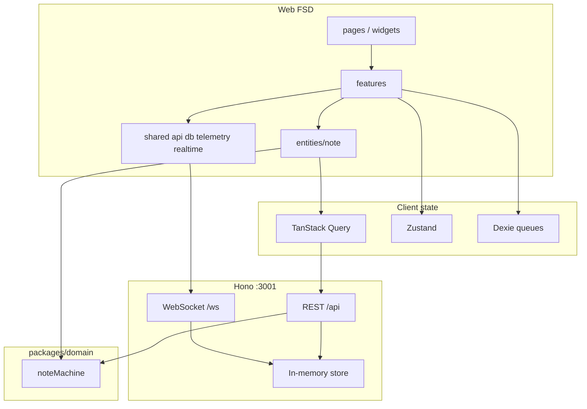

# Soulside AI — Clinical Notes Workflow

Frontend take-home: AI-assisted clinical notes review SPA. Architecture over polish — domain state machine, optimistic concurrency, offline queue, real-time reconcile, virtualized scale, telemetry with PII redaction.

## Quick start

```bash
pnpm install
pnpm dev
```

- Web: http://localhost:5173
- **API Lab:** http://localhost:5173/lab
- API health: http://localhost:3001/api/health (proxied at `/api/health`)

### Scripts

| Command | Purpose |
|---|---|
| `pnpm dev` | Web + API |
| `pnpm test` | Unit/integration (domain + web Vitest) |
| `pnpm simulate` | Multi-reviewer API simulation (+ extra scenarios) |
| `pnpm simulate:scenarios` | Extra scenarios only |
| `pnpm test:e2e` | Playwright smoke (boots API+web if needed) |
| `pnpm typecheck` | All packages |

Chaos defaults on for realism. Deterministic demos: `CHAOS=0` or `POST /api/dev/chaos`.

### Try in UI — Phase 2

1. Run `pnpm dev`, open http://localhost:5173/lab
2. Click **Seed** (e.g. 500), then **List notes**
3. **Connect WS**, then **Pick READY note** (or click a row)
4. **Start review** → **Save version** → **Force 409 conflict** → **Approve** or **Reject**
5. Watch the event log for HTTP results and live `note.*` WebSocket messages
6. Toggle **Chaos** ON to feel latency / occasional 500s

### Try in UI — Phase 3

1. Open http://localhost:5173 — use **Act as** in the header to switch roles
2. As **Auditor Lee**: Notes works. Admin / API Lab show **Permission denied** (not empty). Nav items are struck through with hover reasons. On Notes, bulk actions are disabled with a reason tooltip
3. As **Dr. A (REVIEWER)**: Notes + Lab open; Admin stays denied; bulk assign enables
4. As **Admin Kim**: Admin + Lab all open
5. Reload the page — the selected actor persists (Zustand + localStorage)

### Try in UI — Phase 4

1. Ensure API is running (auto-seeds 5000 notes). Open http://localhost:5173/notes
2. Scroll the list — more pages load; footer shows loaded / matching counts
3. Toggle status chips, search (debounced), reviewer, dates — URL updates; copy/paste the URL to deep-link
4. Click column headers (Status / Updated / Created) to sort
5. Select rows across scroll; use **Start review** / **Request regeneration** on the sticky bulk bar (as REVIEWER/ADMIN). Watch optimistic status chips update
6. Clear filters vs search with no matches — empty workspace vs **no results** messaging differ
7. Click a patient name → detail

### Try in UI — Phase 5

1. From `/notes`, open a `READY_FOR_REVIEW` note as **Dr. A**
2. Action bar shows **Start review** (from `getAvailableActions`). Start it — status becomes `IN_REVIEW`
3. Edit SOAP sections — each dirty section gets a **Dirty** badge; **Save draft** enables
4. Save — revision bumps; dirty badges clear
5. Try **Approve** (confirm = mock MFA) or **Reject** (reason prompt). Hover disabled actions when signed in as the wrong role
6. Open a `LOCKED` note — editor read-only + lock message (no amend path)
7. As **Auditor Lee**, open any note — SOAP read-only (no `mutate_workflow`)

### Try in UI — Phase 6

1. Open an `IN_REVIEW` note as **Dr. A**. Edit SOAP — watch status flip to dirty, then **Saving…** (~800ms), then **Saved** without clicking Save
2. Type quickly — saves coalesce (one in-flight POST; at most one follow-up)
3. Arm **Force conflict on next save**, edit, wait for autosave (or Save now) → three-way merge modal (ancestor / yours / server with word diffs)
4. Pick sections → **Resolve & save** — revision advances; no duplicate versions if you retry the same `clientMutationId`
5. **Fail next save (500)** then edit — optimistic paint rolls back; error shows; Retry reuses the same mutation id
6. List filters survive detail ↔ back (search params preserved on Links)

### Try in UI — Phase 7

1. Open `/notes` — header badge should read **Live**
2. Open the same `IN_REVIEW` note in two browser tabs (optionally different actors via **Act as**)
3. In tab A, **Start review** / **Approve** / edit+save — tab B list status chip and detail update without refresh; presence avatars appear while both have the note open
4. In tab A, edit SOAP and leave dirty; in tab B save a different edit — tab A opens the same three-way conflict merge UI
5. Kill the API briefly or throttle network — badge shows **Reconnecting…**, then **Live**; missed events replay via `lastEventId`

### Try in UI — Phase 8

1. Browse `/notes` while online (load a page of rows), open an `IN_REVIEW` note
2. DevTools → Network → **Offline** — header badge flips to **Offline**, amber banner appears
3. Edit SOAP — autosave enqueues to IndexedDB; button may show **Queued**
4. ← Notes — cached list still shows; opening an uncached note shows **You’re offline** (not “not found”)
5. Reload while still offline — queued content restores from Dexie; pending count survives
6. Go online — banner **Back online · syncing…**, queue drains, revision bumps

### Try in UI — Phase 9

1. Open a note with multiple revisions (save a few SOAP edits while `IN_REVIEW`)
2. In **Version history**, click two revisions — SOAP word-diff appears (older → newer)
3. Run a transition (Start review / Approve) — **Review timeline** shows the status edge
4. DevTools Offline → queue a transition or save — timeline shows an amber **Optimistic** row until sync

### Try in UI — Phase 10

1. Bottom-right **Telemetry** (dev only) — open panel; counts for buffered / flushed / parked
2. **Emit sample** — Network → `POST /api/telemetry/batch`; body has `content`/`S` as `[redacted]`, never free text
3. Edit SOAP / run a transition — events batch (~4s or 20 events); **Flush now** to force send
4. **Fail ×3 + flush** — after 3 injected 500s the batch parks in IndexedDB (`Parked`); **Flush now** again replays
5. Hard-refresh mid-buffer (or switch tabs) — `sendBeacon` / keepalive flush; parked rows survive reload

### Try in UI — Phase 11

1. With API up: `pnpm simulate` — three reviewers finish ~60 notes; scenarios assert 409 merge, reject/resubmit, WS ordering, burst fetches
2. `pnpm test` — machine + autosave coalesce + queue coalesce + realtime dedupe/cap + redact
3. `pnpm test:e2e` — Playwright: filter READY → open → Start review → edit → Approve
4. Force a render error (temporary throw in a page) — header stays; **Try again** / **Back to notes**

### Try in UI — Phase 12

1. Home (dev): **Throw page render error** — header stays; page fallback; Telemetry shows `ui.error` with `source: render`
2. Home: **Fire unhandled rejection** — console + `ui.error` with `source: unhandledrejection` (boundaries cannot catch this)
3. Open an `IN_REVIEW` note → **Throw SOAP panel error** — only the SOAP card falls back; history/actions stay up
4. Same note → **Throw page error** — whole outlet fallback; navigate away or Try again resets via `resetKeys`

## Workspace

| Package | Role |
|---|---|
| `apps/web` | Vite + React SPA (Feature-Sliced Design) |
| `apps/api` | Hono mock REST + WebSocket + deterministic seed |
| `packages/domain` | Shared types + pure `noteMachine` |
| `simulate_workflow.ts` | Assignment sim + extra API scenarios |

### Web FSD layout

```
apps/web/src/
  app/         # providers, styles, shell
  pages/       # routable screens
  widgets/     # composite UI blocks
  features/    # user-facing capabilities
  entities/    # business entities
  shared/      # ui, api, db (Dexie), config, lib, telemetry, realtime
```

Import rule: layers only depend downward (`app` → `pages` → `widgets` → `features` → `entities` → `shared`).

## Architecture overview



**Effect flow (save):** draft (Zustand) → coalesced autosave → optimistic Query patch → POST version → ack / 409 merge / offline Dexie enqueue → drain on reconnect → WS `version_added` reconciled into Query (deduped by `eventId`).

## Design decisions

### State Topology — Where state lives

- **Pure domain (`packages/domain`)** — lifecycle invariants via `noteMachine` (no React, no I/O)
- **Zustand** — session/actor; note selection; SOAP editor drafts; presence; conflict modal; connectivity
- **TanStack Query** — notes list/detail/versions; optimistic patches; live WS reconciliation; 35m `gcTime` for offline reads; `dev-users` with `staleTime: Infinity`
- **Dexie** — mutation write queue (Phase 8); telemetry park (Phase 10)
- **URL** — list filters/sort/search (preserved across detail Links)
- **WebSocket** — viewport + detail subscriptions; reconnect cursor replay
- **Telemetry batcher** — in-memory buffer → `/api/telemetry/batch`; Dexie park after retries

Server entities stay out of Zustand. Dexie is not a notes cache — only durable *client intent*.

### State Machine — How the note lifecycle is modelled

Implemented as a pure module in [`packages/domain/src/note-machine`](packages/domain/src/note-machine):

- **Transition table** (`TRANSITIONS`) is the single source of truth for legal edges and guards
- **`can` / `transition`** validate user intent before any API call
- **`applyServerStatusChange`** runs real-time / authoritative status pushes through the same table (`source: "server"` trusts MFA already happened)
- **`getAvailableActions`** drives the action bar — disabled buttons carry human-readable `reason` strings
- Invalid transitions are rejected in one place; UI must not hard-code status `if` checks

Happy path: `GENERATING → READY_FOR_REVIEW → IN_REVIEW → APPROVED → LOCKED` (plus `FAILED`, `REJECTED`, `AMENDED` branches).

```bash
pnpm --filter @soulside/domain test
```

### Optimistic Updates — Apply and roll back

_Phase 4 (list):_ bulk transitions patch the TanStack Query infinite-list cache optimistically, then reconcile with the server response or roll back on failure.

_Phase 6 (detail):_ coalesced autosave paints draft SOAP into the detail (+ list `updatedAt`) before the POST resolves; on `500`/`409` the snapshot is restored. Conflicts open a merge modal instead of silently dropping edits.

_Phase 9 (timeline):_ pending Dexie queue items appear as amber optimistic rows on the review timeline until drain/ack refreshes `review.events`.

### Concurrency — Version conflicts without data loss

`POST /api/notes/:id/versions` requires `baseVersionId`. Mismatch (or `X-Force-Conflict: 1` / chaos / fail-next) returns `409 version_conflict` with **content** for `current` + `commonAncestor`. Detail UI: three-way merge (yours / server / ancestor), word-level `diff`, resolve retargets `baseVersionId` to server head and saves once. Mutations stay idempotent via `clientMutationId` (retry after 5xx reuses the id).

### Offline — Write queue survives reloads

Dexie `mutationQueue` holds `create_version` / `transition` intents. Offline autosave **coalesces** pending version rows per note, then marks the draft clean locally. On reload, pending SOAP is rehydrated from the queue. Reconnect drains `orderBy(createdAt)`; `409` opens the same merge UI. Connectivity banner + header badge both follow `navigator.onLine`; WS disconnects while offline. Uncached detail/list reads show an offline message (not “not found”). Query `gcTime` is 35m so cached reads stay available offline.

### Real-Time — Reconcile channel with optimistic state

App-wide WebSocket (`shared/realtime`): viewport note ids from the virtualizer + open detail; `presence.join` on detail. Events dedupe by `eventId` (capped set ~2k to avoid session leaks). `note.status_changed` / `note.version_added` patch TanStack Query; dirty draft + foreign `version_added` opens the Phase 6 merge UI. Reconnect uses exponential backoff + jitter and resubscribes with `lastEventId` for replay. Header **Live** badge + presence avatars. HTTP ack and WS event may arrive in either order — both paths are idempotent.

### Telemetry — Batch, retry, unload, PII redaction

Only public API: `track(name, props, { important? })` in `shared/telemetry`. Client batches by size (20), timer (4s / 800ms if important), and `visibilitychange` / `pagehide`. After **3** failed sends the batch is **parked in Dexie** (`telemetryPark`) and replayed on later flushes. Unload uses `navigator.sendBeacon` then `fetch({ keepalive: true })`. `redactProps` strips SOAP/`content`/long strings before enqueue; API rejects those keys as defense in depth. Dev **Telemetry** panel shows counts only (no props).

### Scale — List/detail/history at 100k+ notes

TanStack Virtual + infinite cursor query on `/notes`. Filters/sort/search URL-persisted. Seed up to 100k via `POST /api/dev/seed`. Detail version content loads on demand via `GET /notes/:id/versions/:versionId`. Viewport-scoped WS subscriptions (not one socket per row).

### Testing — Unit, integration, e2e posture

| Layer | What | Why |
|---|---|---|
| **Unit** | `noteMachine` (32 cases), `redactProps`, coalesced saver | Pure invariants + effect scheduling |
| **Integration** | Dexie queue coalesce/order, `applyRealtimeEvent` dedupe + seen-id cap | Effectful modules without full browser |
| **API sim** | `simulate_workflow.ts` + overlap / reject-resubmit / RT-before-ack / burst-500 | Assignment script + “build your own” scenarios |
| **E2E smoke** | Playwright filter → open → edit → approve | One critical user path |

**Chosen not to test exhaustively:** every UI permutation, visual regression, full 100k render timing in CI (manual/seed locally). Offline “3 pending muts + 20 min later” is covered by queue integration + Phase 8 Try in UI (Dexie survives reload); wall-clock 20 min is not automated.

### Accessibility — Keyboard, SR, WCAG 2.2 AA

**Posture:** aim for WCAG 2.2 AA on critical flows; polish is secondary to architecture.

| Area | Status |
|---|---|
| Primary nav / role switcher | Landmark + labelled control |
| Notes filters / table | Native controls; row checkboxes labelled |
| SOAP editor | Per-section `<label>` + `aria-label` on textareas |
| Actions | Disabled buttons expose machine `reason` via `title` |
| Conflict modal | `role="dialog"` + labelled title |
| Route / panel crash | Nested `react-error-boundary` (`AppErrorBoundary`); header stays |
| **Gaps** | No full axe CI suite; focus trap in conflict modal is light; live regions for status/presence are minimal |

### Error handling & auth posture

- API errors surface as actionable UI (rollback, merge, queue hint) — not silent drops
- **Render:** nested `react-error-boundary` (app → page → SOAP/history/conflict panels) with `onError` → `track("ui.error")`
- **Non-render:** `window` `error` / `unhandledrejection` + TanStack Query/Mutation cache `onError` → same reporter (boundaries cannot catch these)
- Auth is **simulated** (dev actors + capability matrix); server remains authoritative for transitions
- Telemetry redacts PII; mutation queue may hold clinical text locally (IndexedDB) — acceptable for take-home offline demo, called out as a production hardening area (encryption-at-rest)

## Assumptions

1. Single mock API process; in-memory store resets on restart (seed is deterministic).
2. No real IdP — `Act as` stands in for session identity.
3. MFA for approve is a `window.confirm` stand-in.
4. “20 minutes offline” is demonstrated by Dexie durability across reload, not a literal CI sleep.
5. Evaluators run locally on Node 20+ / modern Chromium; no deploy required.
6. Random chaos may make a single click flake; use `CHAOS=0` or fail-next for demos; sim retries 500s.

## Verification checklist

- [ ] `pnpm dev` — list virtualizes; detail autosaves; two-tab Live updates
- [ ] Force 409 — merge UI keeps both sides’ intent
- [ ] Offline edit → reload → online drain
- [ ] Telemetry Emit sample — redacted props in Network
- [ ] `pnpm test` green
- [ ] `pnpm simulate` completes
- [ ] `pnpm test:e2e` green

## Dummy API

| Method | Path | Notes |
|---|---|---|
| GET | `/api/health` | Store stats |
| POST | `/api/dev/seed` | `{ count, seed? }` deterministic |
| GET | `/api/dev/users` | Seeded actors |
| GET | `/api/dev/ready-note` | First `READY_FOR_REVIEW` |
| GET | `/api/notes` | Cursor + filters/sort |
| GET | `/api/notes/:id` | Detail + versions meta + review events |
| GET | `/api/notes/:id/versions/:versionId` | Full version content |
| POST | `/api/notes/:id/versions` | `baseVersionId`, `content`, `clientMutationId` |
| POST | `/api/notes/:id/transitions` | Validated by `noteMachine` |
| POST | `/api/telemetry/batch` | Batched events; rejects PII-ish keys |
| GET | `/api/telemetry/recent` | Batch summaries |
| WS | `/ws` | `subscribe` / `replay` / `presence.join` |

Chaos (default on): latency, ~5% `500`, ~2% version conflicts. `CHAOS=0` disables. `POST /api/dev/chaos` `{ "failNext": { "versions": 1, "telemetry": 3, ... } }`. Auto-seed 5000 unless `AUTO_SEED=0`.

## Auth & guards (Phase 3)

Client-side UX only. Server remains authoritative.

| Layer | Mechanism |
|---|---|
| Route | `RequireCapability` → permission denied panel |
| Nav | Struck-through items with `title` reason |
| Action | Disabled + machine/capability reason |
| Session | Zustand persist; `X-Actor-Id` on API calls |

## Phase status

- [x] Phase 0 — Scaffold & contracts
- [x] Phase 1 — Domain state machine
- [x] Phase 2 — Dummy backend (+ API Lab UI at `/lab`)
- [x] Phase 3 — Auth shell + Query plumbing
- [x] Phase 4 — Virtualized notes list
- [x] Phase 5 — Note detail + SOAP editor
- [x] Phase 6 — Autosave & conflicts
- [x] Phase 7 — Real-time
- [x] Phase 8 — Offline queue
- [x] Phase 9 — Version history
- [x] Phase 10 — Telemetry
- [x] Phase 11 — Simulation, tests, README polish
- [x] Phase 12 — Error boundaries (`react-error-boundary`) + global/Query reporters
