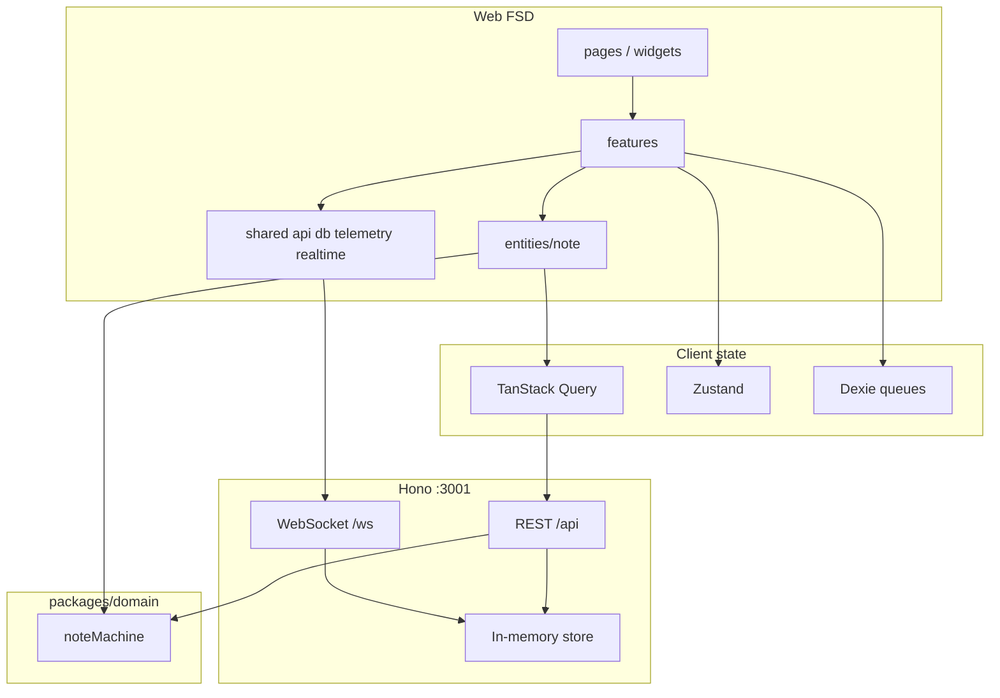
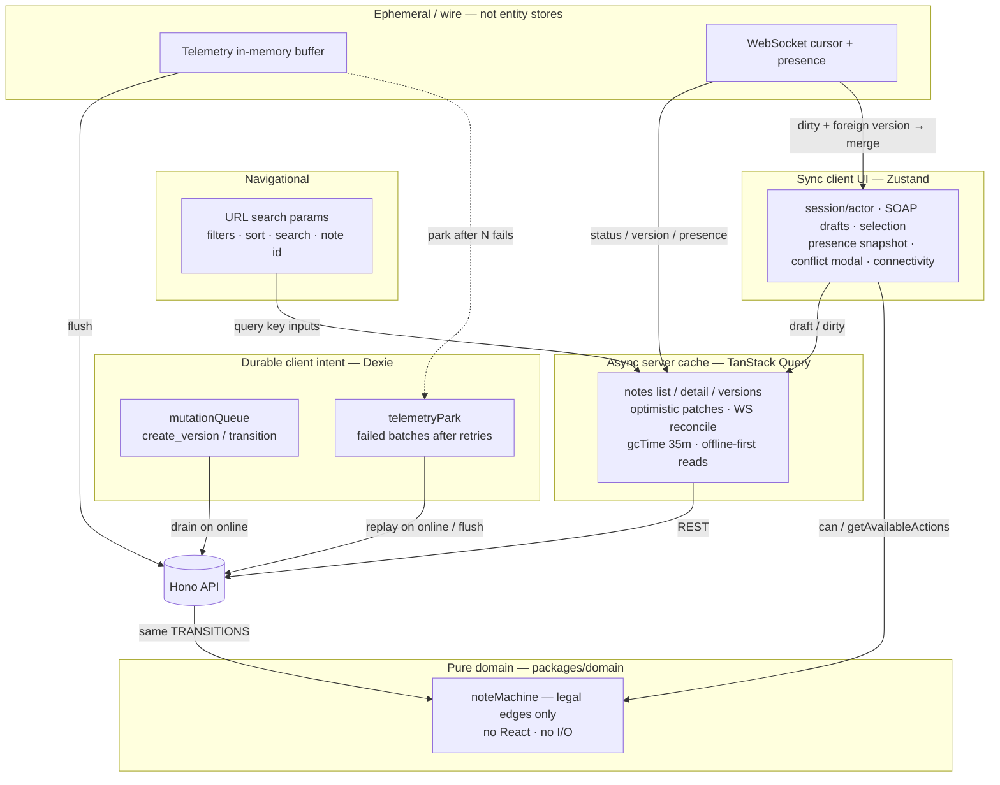
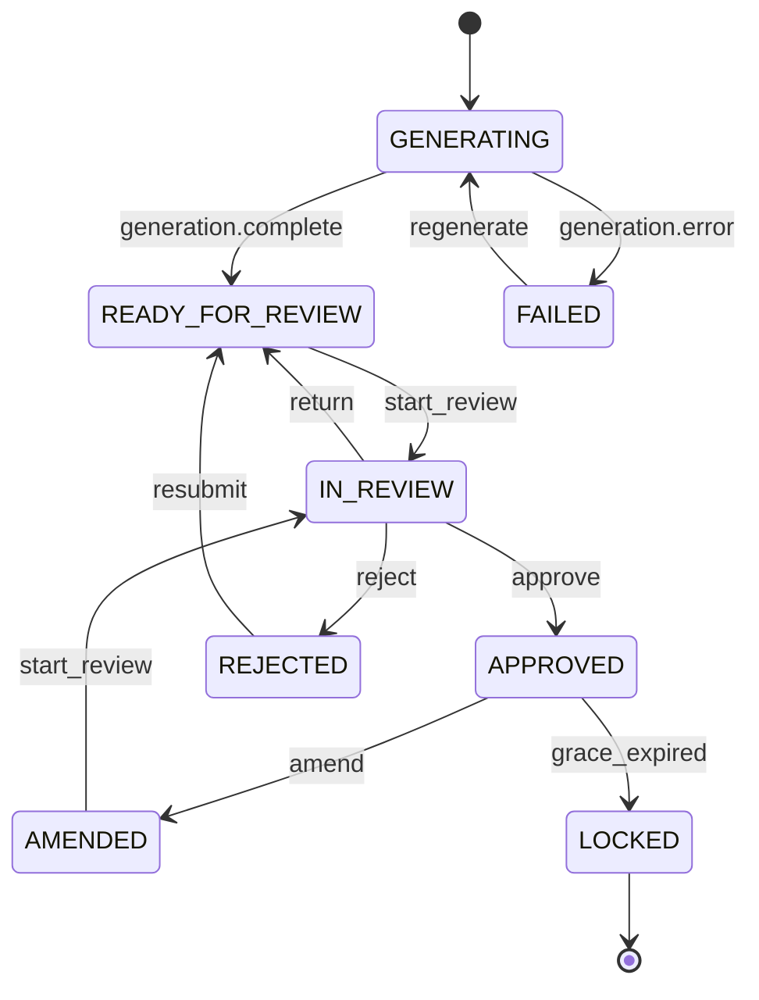

# Soulside AI — Clinical Notes Workflow

Frontend take-home: AI-assisted clinical notes review SPA. Architecture over polish — domain state machine, optimistic concurrency, offline queue, real-time reconcile, virtualized scale, telemetry with PII redaction.

Build phases and “try in UI” walkthroughs live in [`docs/phases.md`](docs/phases.md). Deeper diagrams and ADRs: [`docs/00-index.md`](docs/00-index.md).

## Quick start

```bash
pnpm install
pnpm dev
```

- Web: [http://localhost:5173](http://localhost:5173)
- API health: [http://localhost:3001/api/health](http://localhost:3001/api/health) (proxied at `/api/health`)

API auto-seeds **100,000** notes (`SEED_COUNT`, default `100000`). First boot can take a few seconds. Smaller seed: `SEED_COUNT=500 pnpm dev:api`. Chaos defaults on; demos: `CHAOS=0`.

### Scripts

| Command | Purpose |
|---|---|
| `pnpm dev` | Web + API |
| `pnpm test` | Unit/integration (domain + web Vitest) |
| `pnpm simulate` | Multi-reviewer API simulation (+ extra scenarios) |
| `pnpm simulate:scenarios` | Extra scenarios only |
| `pnpm test:e2e` | Playwright smoke (boots API+web if needed) |
| `pnpm typecheck` | All packages |

## Workspace

| Package | Role |
|---|---|
| `apps/web` | Vite + React SPA (Feature-Sliced Design) |
| `apps/api` | Hono mock REST + WebSocket + deterministic seed |
| `packages/domain` | Shared types + pure `noteMachine` |
| `simulate_workflow.ts` | Assignment sim + extra API scenarios |

### Web FSD layout

```
apps/web/src/
  app/         # providers, styles, shell
  pages/       # routable screens
  widgets/     # composite UI blocks
  features/    # user-facing capabilities
  entities/    # business entities
  shared/      # ui, api, db, config, lib, telemetry, realtime, correlation, logging
```

Import rule: layers only depend downward (`app` → `pages` → `widgets` → `features` → `entities` → `shared`).

## Architecture overview



**Effect flow (save):** draft (Zustand) → coalesced autosave → optimistic Query patch → POST version → ack / 409 merge / offline Dexie enqueue → drain on reconnect → WS `version_added` reconciled into Query (deduped by `eventId`).

---

## Design decisions

### State Topology — Where state lives

Your four layers are right. The full topology also includes a **pure domain machine**, an **in-memory telemetry buffer**, and **WebSocket presence/cursor** (not a fifth “source of truth” for notes).



| Layer | Owns | Does not own |
|---|---|---|
| **URL** | Filters, sort, search, deep links | Note bodies |
| **Zustand** | Session, drafts, selection, conflict UI, connectivity, presence snapshot | Server note entities |
| **TanStack Query** | Notes / versions / review events (server cache) | Typing keystrokes |
| **Dexie** | Mutation outbox + parked telemetry | Full offline notes replica |
| **noteMachine** | Lifecycle legality | Persistence / HTTP |
| **Telemetry buffer / WS** | Batching + live fan-in | Authoritative status |

Server entities stay out of Zustand. Dexie is durable *client intent*, not a notes cache.

More detail: [`docs/02-state-layers.md`](docs/02-state-layers.md).

### State Machine — How the note lifecycle is modelled

Implemented as a pure module in [`packages/domain/src/note-machine`](packages/domain/src/note-machine):

- **`TRANSITIONS`** — single table for legal edges + guards + effects
- **`can` / `transition`** — validate user intent before any API call
- **`applyServerStatusChange`** — WS / authoritative pushes use the same table (`source: "server"`)
- **`getAvailableActions`** — action bar; disabled buttons carry human-readable `reason`
- UI must not hard-code status `if` trees for “what buttons exist”



Each arrow maps 1:1 to a row in [`transitions.ts`](packages/domain/src/note-machine/transitions.ts). Happy path: `GENERATING → READY_FOR_REVIEW → IN_REVIEW → APPROVED → LOCKED` (plus `FAILED`, `REJECTED`, `AMENDED` branches).

#### Analogy: `noteMachine` ↔ React

| React | This codebase |
|---|---|
| **`react`** — pure rules for how UI state updates (no DOM) | **`noteMachine`** — pure rules for how note status updates (no HTTP/DOM) |
| **`react-dom`** — host that applies those rules to the browser | **`apps/api` + `apps/web`** — hosts that apply transitions via REST, WS, Query, and the UI |

You import the same machine on the server (reject illegal transitions) and in the client (derive buttons / optimistic intent). Swapping the host (different UI kit, different transport) does not rewrite the lifecycle — the same way swapping `react-dom` for another renderer does not rewrite React.

```bash
pnpm --filter @soulside/domain test
```

### Optimistic Updates — Apply and roll back

- **List:** bulk transitions patch the infinite-list cache, then reconcile or roll back.
- **Detail:** coalesced autosave paints draft SOAP into detail (+ list `updatedAt`) before POST; on `500`/`409` the snapshot restores. Conflicts open merge UI instead of dropping edits.
- **Timeline:** pending Dexie items appear as amber optimistic rows until drain/ack.

### Concurrency — Version conflicts without data loss

`POST /api/notes/:id/versions` requires `baseVersionId`. Mismatch (or force/chaos) → `409 version_conflict` with content for `current` + `commonAncestor`. UI: three-way merge (yours / server / ancestor), word-level `diff`, resolve retargets `baseVersionId` to server head. Idempotent via `clientMutationId`.

### Offline — Write queue survives reloads

Dexie `mutationQueue` holds `create_version` / `transition` intents. Offline autosave coalesces pending version rows per note. Reload rehydrates SOAP from the queue. Reconnect drains FIFO; `409` opens the same merge UI. Connectivity banner + header badge follow `navigator.onLine`. Query `gcTime` is 35m for cached offline reads.

### Real-Time — Reconcile channel with optimistic state

App-wide WebSocket: viewport note ids + open detail; `presence.join` on detail. Events dedupe by `eventId` (capped ~2k). Dirty draft + foreign `version_added` → merge UI. Reconnect: exponential backoff + jitter, resubscribe with `lastEventId`. HTTP ack and WS may arrive in either order — both paths are idempotent.

### Telemetry — Batch, retry, unload, PII redaction

Only public API: `track(name, props, { important? })`. Batches by size (20), timer (4s / 800ms if important), and visibility/pagehide. After **3** failed sends the batch is **parked in Dexie** and replayed on later flushes.

**Parked rows after going online:** previously, replay only ran on boot / successful flush, and rows that hit the attempt cap were left forever — so parked could stick after reconnect. Now `window` `online` triggers `flush("online")`, which **resets attempt counters** and drains the park. Manual **Flush now** does the same. Rows still park while chaos/`failNext` is failing; once the API accepts traffic again, the next online/flush clears them.

Unload uses `sendBeacon` then `fetch({ keepalive: true })`. `redactProps` strips SOAP/`content`/long strings; API rejects those keys as defense in depth.

### Correlation IDs — UI → HTTP → telemetry → WS

`shared/correlation` ambient id wraps saves / transitions / drain / merge / page views. `apiFetch` always sends `X-Correlation-Id`; API echoes it and attaches it to WS events. `track` / `reportError` / `shared/logging` merge the same field.

### Scale — List/detail/history at 100k+ notes

TanStack Virtual + infinite cursor query. Filters/sort/search URL-persisted. Default seed **100k**. Detail version content loads on demand. Viewport-scoped WS subscriptions.

### Keyboard shortcuts

Primary CTAs show their key on the button (green Start review / Approve / Amend; red Reject). Header **Shortcuts ?** opens the full list.

| Keys | Action |
|---|---|
| `?` | Shortcuts help |
| `D` | Toggle demo controls FAB (dev) |
| `T` | Toggle telemetry panel (dev) |
| `R` / `A` / `M` / `X` / `E` | Start review / Approve / Amend / Reject / Return |
| `⌃S/O/A/P` (Mac) or `Alt+S/O/A/P` (Win) | Focus SOAP section (works while typing) |
| `⌘/Ctrl+S` | Save draft |
| `/` | Focus notes search |
| `g` `n` / `h` | Notes / Home |
| `j` / `k` / `Enter` | Row focus / open note |
| `Esc` | Close help / conflict |

### Testing — Unit, integration, e2e posture

| Layer | What | Why |
|---|---|---|
| **Unit** | `noteMachine`, `redactProps`, coalesced saver | Pure invariants + effect scheduling |
| **Integration** | Dexie queue coalesce/order, realtime dedupe + seen-id cap | Effectful modules without full browser |
| **API sim** | `simulate_workflow.ts` + overlap / reject-resubmit / RT-before-ack / burst | Assignment + “build your own” scenarios |
| **E2E smoke** | Playwright filter → open → edit → approve | One critical user path |

**Chosen not to test exhaustively:** every UI permutation, visual regression, full 100k render timing in CI, literal 20-minute sleep (Dexie durability across reload covers the offline intent).

### Accessibility — Keyboard, SR, WCAG 2.2 AA

**Posture:** aim for WCAG 2.2 AA on critical flows; architecture over polish.

| Area | Status |
|---|---|
| Primary nav / role switcher | Landmark + labelled control |
| Notes filters / table | Native controls; row checkboxes use visible `sr-only` label text |
| SOAP editor | Per-section `<label>` + `aria-label` on textareas |
| Actions | Disabled buttons expose machine `reason` via `title` |
| Conflict modal | `role="dialog"` + labelled title |
| Shortcuts | App-wide keys + help dialog |
| **Gaps** | No full axe CI; conflict focus trap is light; live regions for status/presence are minimal |

### Error handling & auth posture

- API errors surface as actionable UI (rollback, merge, queue hint)
- Nested `react-error-boundary` + `window` / Query `onError` → `track("ui.error")`
- Auth is **simulated** (dev actors + capability matrix); server remains authoritative
- Telemetry redacts PII; mutation queue may hold clinical text locally (IndexedDB) — production hardening: encryption-at-rest

---

## Assumptions

1. Single mock API process; in-memory store resets on restart (seed is deterministic).
2. No real IdP — `Act as` stands in for session identity.
3. MFA for approve is a `window.confirm` stand-in.
4. “20 minutes offline” is demonstrated by Dexie durability across reload, not a literal CI sleep.
5. Evaluators run locally on Node 20+ / modern Chromium; no deploy required.
6. Random chaos may flake a single click; use `CHAOS=0` or fail-next for demos; sim retries 500s.

---

## Dummy API

| Method | Path | Notes |
|---|---|---|
| GET | `/api/health` | Store stats |
| POST | `/api/dev/seed` | `{ count, seed? }` (max 100k) |
| GET | `/api/dev/users` | Seeded actors |
| GET | `/api/dev/ready-note` | First `READY_FOR_REVIEW` |
| GET | `/api/notes` | Cursor + filters/sort |
| GET | `/api/notes/:id` | Detail + versions meta + review events |
| GET | `/api/notes/:id/versions/:versionId` | Full version content |
| POST | `/api/notes/:id/versions` | `baseVersionId`, `content`, `clientMutationId` |
| POST | `/api/notes/:id/transitions` | Validated by `noteMachine` |
| POST | `/api/telemetry/batch` | Batched events; rejects PII-ish keys |
| GET | `/api/telemetry/recent` | Batch summaries |
| WS | `/ws` | `subscribe` / `replay` / `presence.join` |

Chaos (default on): latency, ~5% `500`, ~2% version conflicts. `CHAOS=0` disables. `POST /api/dev/chaos` `{ "failNext": { "versions": 1, "telemetry": 3, ... } }`.

## Auth & guards

Client-side UX only. Server remains authoritative.

| Layer | Mechanism |
|---|---|
| Route | `RequireCapability` → permission denied panel |
| Nav | Struck-through items with `title` reason |
| Action | Disabled + machine/capability reason |
| Session | Zustand persist; `X-Actor-Id` on API calls |

---

## Assignment verification checklist

Mapped from *Frontend System Design and Architecture Assignment.pdf*. Status reflects this repo.

### Deliverables

| Requirement | Status | Evidence |
|---|---|---|
| GitHub-ready complete source | Done | Monorepo `apps/web`, `apps/api`, `packages/domain` |
| README: run, architecture, decisions, assumptions | Done | This file |
| State-machine as code (and diagram) | Done | `packages/domain` + diagram above |
| Own test scenarios beyond sim script | Done | Vitest + `simulate:scenarios` + Playwright |
| Optional architecture diagrams | Done | Mermaid in README + `docs/` |

### Functional — Notes list

| Requirement | Status | Notes |
|---|---|---|
| Cursor-paginated virtualized list @ 100k+ | Done | TanStack Virtual + infinite query; default seed 100k |
| Filter panel (status, reviewer, dates) URL-persisted | Done | Patient free-text via search; no separate patient multi-select control |
| Debounced server search; empty ≠ no-results | Done | |
| Sortable columns, URL-persisted | Done | |
| Bulk actions; selection across scroll | Done | Assign-me / regenerate |
| Skeleton / optimistic row updates | Done | |

### Functional — Note detail

| Requirement | Status | Notes |
|---|---|---|
| SOAP sections independently dirty-tracked | Done | |
| Version history + word-level diff | Done | Character-level = bonus, not done |
| Status-driven action bar with reasons | Done | `getAvailableActions` |
| LOCKED read-only | Done | Amend is from **APPROVED** within 24h (machine), not from LOCKED |
| Live presence | Done | |

### State machine engine

| Requirement | Status |
|---|---|
| Pure unit-testable module | Done |
| Validate before API; rollback on reject | Done |
| Server-pushed transitions through same machine | Done |
| Optimistic local ReviewEvent + reconcile | Done |

### Autosave & conflicts

| Requirement | Status |
|---|---|
| Debounced autosave while dirty | Done |
| Coalesce: ≤1 in-flight + ≤1 follow-up | Done |
| `baseVersionId` + three-way merge on 409 | Done |
| `clientMutationId` idempotency | Done |

### Offline

| Requirement | Status |
|---|---|
| Usable offline ≥30m from cache | Done | `gcTime` 35m + queue |
| Write queue survives reload (IndexedDB) | Done | Dexie |
| Ordered replay + same merge UI | Done | |
| Non-modal connectivity status | Done | |

### Real-time

| Requirement | Status |
|---|---|
| Viewport + detail subscribe/unsubscribe | Done |
| Merge with optimistic; same conflict UI | Done |
| Backoff + jitter; `lastEventId` replay | Done |

### Telemetry

| Requirement | Status |
|---|---|
| `track()` only; batched flush | Done |
| Retry → park in IDB; unload beacon | Done |
| PII redaction | Done |

### Authorization

| Requirement | Status |
|---|---|
| Roles CLINICIAN / REVIEWER / ADMIN / READONLY_AUDITOR | Done |
| Route / component / action guards; denied ≠ empty | Done |
| Client auth is UX-only | Done |

### Dummy backend + simulation

| Requirement | Status |
|---|---|
| Latency + ~5% failure; mock WS; deterministic seed | Done |
| `simulate_workflow.ts` multi-reviewer path | Done |
| Extra scenarios (overlap, offline intent, RT-before-ack, …) | Done |

### Required design write-ups

All ten topics addressed in **Design decisions** above (topology, machine, optimistic, concurrency, offline, real-time, telemetry, scale, testing, accessibility).

### Bonuses present

| Bonus | Status |
|---|---|
| Word-level diffs | Done |
| Correlation IDs + structured logging | Done |
| CRDT collab / plugins / flags / workers / PWA / federation | Not done |

### Local verification

- [ ] `pnpm dev` — list virtualizes at 100k; detail autosaves; two-tab Live updates
- [ ] Force 409 — merge UI keeps both sides’ intent
- [ ] Offline edit → reload → online drain
- [ ] Telemetry Fail×3 → park → Flush now / go online → park clears
- [ ] WAVE: notes checkboxes announce patient / “Select all…” (not empty labels)
- [ ] `?` opens shortcuts; `/` focuses search
- [ ] `pnpm test` / `pnpm simulate` / `pnpm test:e2e` green
