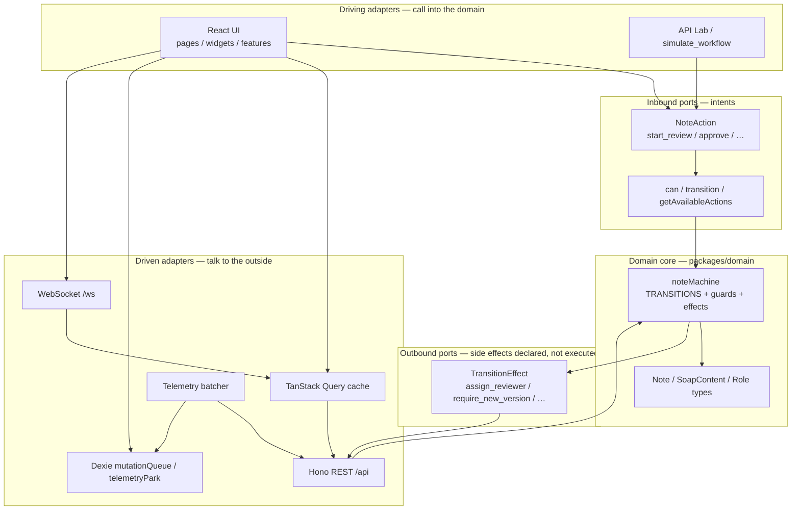

# Hexagonal architecture (ports & adapters)

Maps this repo onto hexagonal / ports-adapters thinking. The goal of the diagram: **domain stays pure; React, HTTP, WS, and Dexie are replaceable adapters.**

## Diagram

## How to read it in this codebase

| Hexagon idea | Soulside mapping |
|---|---|
| **Core** | `packages/domain` — no React, no `fetch`, no IndexedDB |
| **Inbound port** | `can` / `transition` / `getAvailableActions` — UI asks “may I?” before POST |
| **Outbound effects** | `TransitionEffect[]` — domain *declares* assign/release; API *applies* them |
| **Driving adapter** | Action bar, bulk bar, Lab, simulation script |
| **Driven adapter** | `shared/api`, `shared/realtime`, Dexie queues, telemetry |

## Interview one-liner

> We kept clinical lifecycle invariants in a pure module so both the SPA and the mock API validate the same edges. UI and storage are adapters; they must not invent status rules.

## Related code

- `packages/domain/src/note-machine/`
- `apps/web/src/features/transition-note/`
- `apps/api` transition handlers (server also consults the machine)
