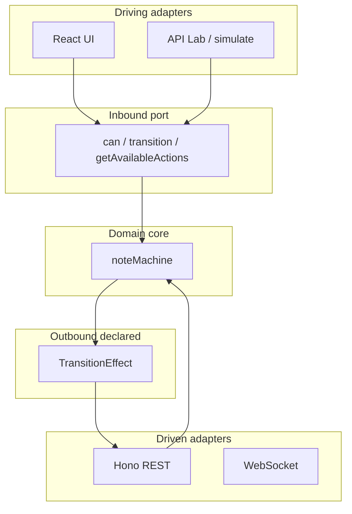

# Hexagonal architecture (ports & adapters)

**Honest take:** we use hexagonal **principles on the clinical lifecycle core**, not a textbook hexagon for the entire SPA.

| Hexagonal rule | Here? |
|---|---|
| Domain has no UI / DB / HTTP | **Yes** — `packages/domain` |
| Outside enters via a port | **Mostly** — `can` / `transition` / `getAvailableActions` |
| UI and API share the same core | **Yes** |
| Formal outbound Port interfaces (`NoteRepository`) | **Soft** — domain returns `TransitionEffect[]`; adapters apply them |
| Every feature (list, WS, telemetry) is hexagonal | **No** — FSD + Query/Zustand around the core |

**Interview line:** *“Hexagonal core for note lifecycle; the rest is FSD + state topology.”*

Pick the diagram style you prefer (image / ASCII / Mermaid).

---

## LucidChart-style


---

## ASCII blocks

```
┌──────────────────────┐                      ┌──────────────────────┐
│  DRIVING ADAPTERS    │                      │  DRIVEN ADAPTERS     │
│  (call into core)    │                      │  (outside world)     │
│                      │                      │                      │
│  • React Action Bar  │                      │  • Hono REST API     │
│  • Bulk actions      │                      │  • In-memory store   │
│  • API Lab           │                      │  • WebSocket hub     │
│  • simulate_workflow │                      │                      │
└──────────┬───────────┘                      └──────────▲───────────┘
           │ intents                                     │ apply effects
           ▼                                             │
┌──────────────────────────────────────┐                 │
│         INBOUND PORT                 │                 │
│  can / transition /                  │                 │
│  getAvailableActions                 │                 │
└──────────────────┬───────────────────┘                 │
                   ▼                                     │
         ╔═══════════════════════╗                       │
         ║   DOMAIN CORE         ║                       │
         ║   packages/domain     ║                       │
         ║  noteMachine          ║                       │
         ║  TRANSITIONS + guards ║                       │
         ║  types (Note, Role…)  ║                       │
         ╚══════════╤════════════╝                       │
                    │                                    │
                    ▼                                    │
         ┌──────────────────────┐                        │
         │ OUTBOUND (declared)  │────────────────────────┘
         │ TransitionEffect[]   │
         │ assign_reviewer …    │
         └──────────────────────┘
```

**One sentence:** UI/API ask the machine → machine returns ok/fail + effects → API store applies effects. Domain never touches HTTP.

---

## Mermaid (optional)



---

## Code map

| Hexagon idea | Path |
|---|---|
| Core | `packages/domain/src/note-machine/` |
| Driving | `apps/web/src/features/transition-note/` |
| Driven | `apps/api` store + REST/WS |
