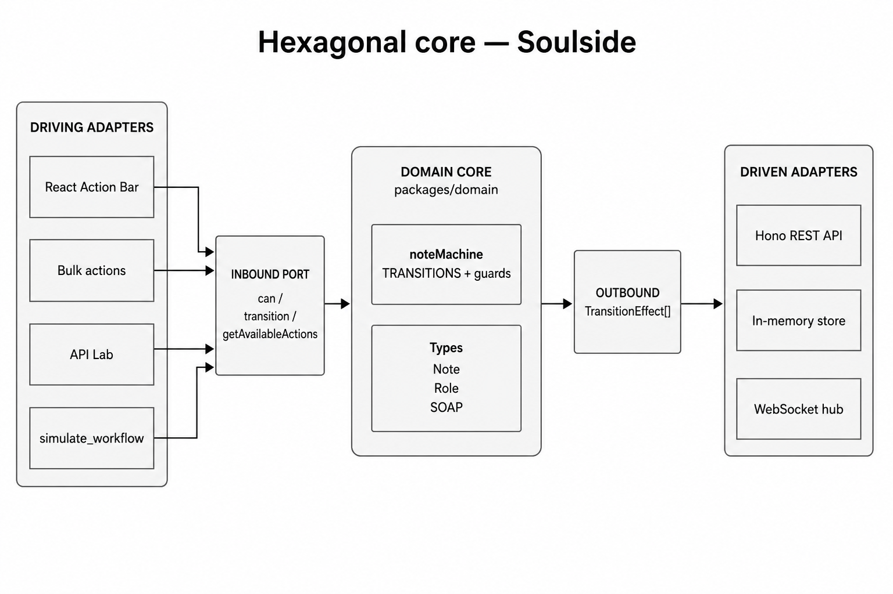

# Hexagonal architecture (ports & adapters)

**Honest take:** we use hexagonal **principles on the clinical lifecycle core**, not a textbook hexagon for the entire SPA.

| Hexagonal rule | Here? |
|---|---|
| Domain has no UI / DB / HTTP | **Yes** — `packages/domain` |
| Outside enters via a port | **Mostly** — `can` / `transition` / `getAvailableActions` |
| UI and API share the same core | **Yes** |
| Formal outbound Port interfaces (`NoteRepository`) | **Soft** — domain returns `TransitionEffect[]`; adapters apply them |
| Every feature (list, WS, telemetry) is hexagonal | **No** — FSD + Query/Zustand around the core |

*“Hexagonal core for note lifecycle; the rest is FSD + state topology.”*

---

## Code map

| Hexagon idea | Path |
|---|---|
| Core | `packages/domain/src/note-machine/` |
| Driving | `apps/web/src/features/transition-note/` |
| Driven | `apps/api` store + REST/WS |
