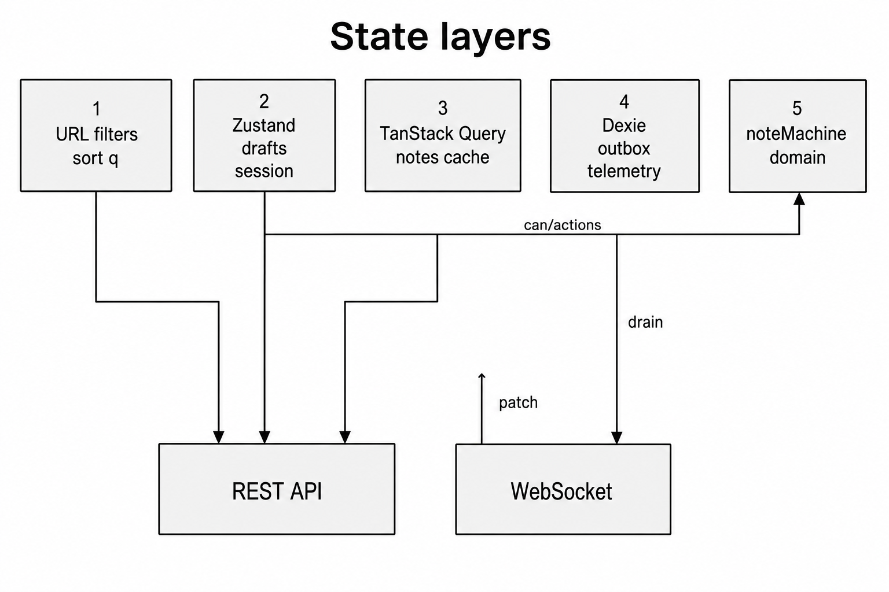
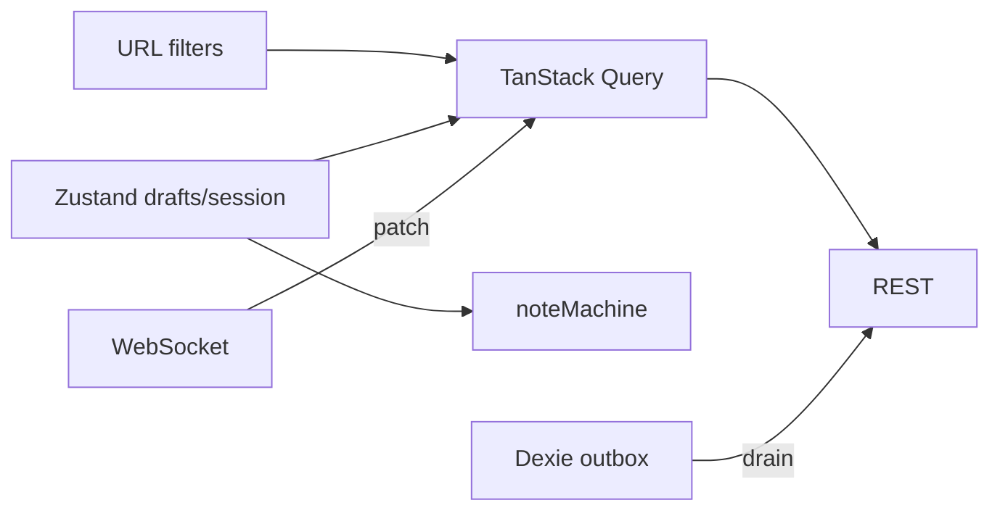

# State layers — where each kind of state lives

Server entities do **not** live in Zustand. Dexie is **not** a notes cache — only durable *client intent*.

Pick the diagram style you prefer (image / ASCII / Mermaid).

---

## LucidChart-style



---

## ASCII blocks

```
┌─────────────┐   ┌─────────────┐   ┌─────────────┐   ┌─────────────┐
│     URL     │   │   Zustand   │   │ TanStack    │   │    Dexie    │
│  filters    │   │  drafts /   │   │   Query     │   │  outbox +   │
│  sort / q   │   │  session    │   │  notes      │   │  telemetry  │
└──────┬──────┘   └──────┬──────┘   └──────┬──────┘   └──────┬──────┘
       │                 │                 │                 │
       │                 ├──can/actions──►┌──────────┐       │
       │                 │                │  domain  │       │
       │                 │                │  machine │       │
       │                 │                └──────────┘       │
       └─────────────────┴────────┬────────┘                 │
                                  ▼                          ▼
                            ┌──────────┐              drain / flush
                            │ REST+WS  │◄────────────────────┘
                            └──────────┘
```

---

## Decision table

| Data | Store | Why |
|---|---|---|
| Note list / detail / versions | TanStack Query | Shared server ownership |
| Actor / “Act as” | Zustand + persist | Session UX |
| Dirty SOAP draft | Zustand | Local typing before POST |
| List filters | URL | Deep-linkable |
| Pending offline save | Dexie `mutationQueue` | Survives reload |
| Parked telemetry | Dexie `telemetryPark` | Survive failed flushes |
| Legal transitions | `noteMachine` | Single source of truth |

---

## Mermaid (optional)



---

## Related code

- `apps/web/src/shared/api/query-client.ts`
- `apps/web/src/features/offline-queue/`
- `apps/web/src/features/autosave-note/`
