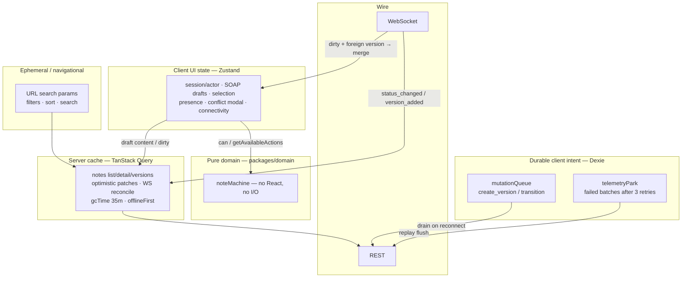

# State layers — where each kind of state lives

Server entities do **not** live in Zustand. Dexie is **not** a notes cache — only durable *client intent*.

## Diagram

## Decision table

| Data | Store | Why |
|---|---|---|
| Note list / detail / versions | TanStack Query | Shared server ownership; stale, refetch, optimistic patch |
| Actor / “Act as” | Zustand + persist | Session UX; not authoritative auth |
| Dirty SOAP draft | Zustand | Local typing; coalesced before POST |
| List filters | URL | Shareable / deep-linkable |
| Pending save while offline | Dexie `mutationQueue` | Survives reload; outbox pattern |
| Parked telemetry | Dexie `telemetryPark` | Survive failed flushes |
| Legal transitions | `noteMachine` | Single source of truth |

## Anti-patterns we avoided

1. Putting full `Note` entities in Zustand (duplicates TQ, fights WS updates).
2. Using Dexie as an offline mirror of all notes (huge sync surface; take-home uses queue-only).
3. Encoding status `if` trees in UI components (machine owns edges).

## Related code

- `apps/web/src/shared/api/query-client.ts` — `gcTime: 35m`, mutations `retry: false`
- `apps/web/src/features/offline-queue/`
- `apps/web/src/features/edit-soap/` + `autosave-note/`
