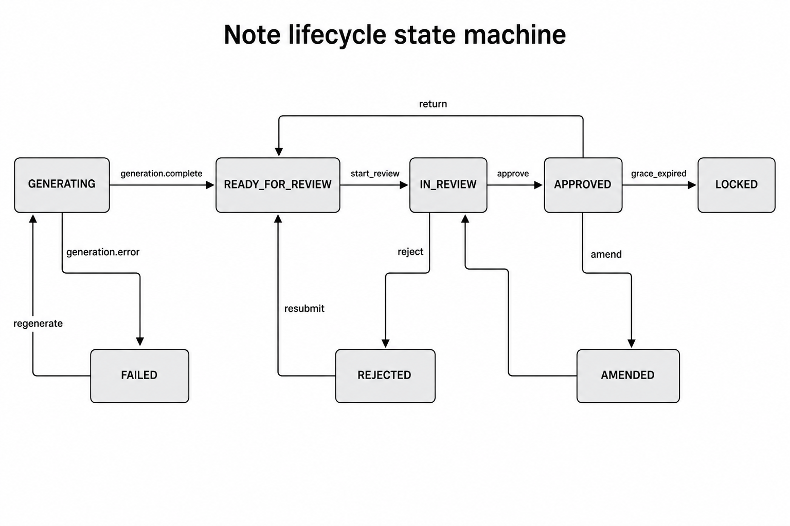
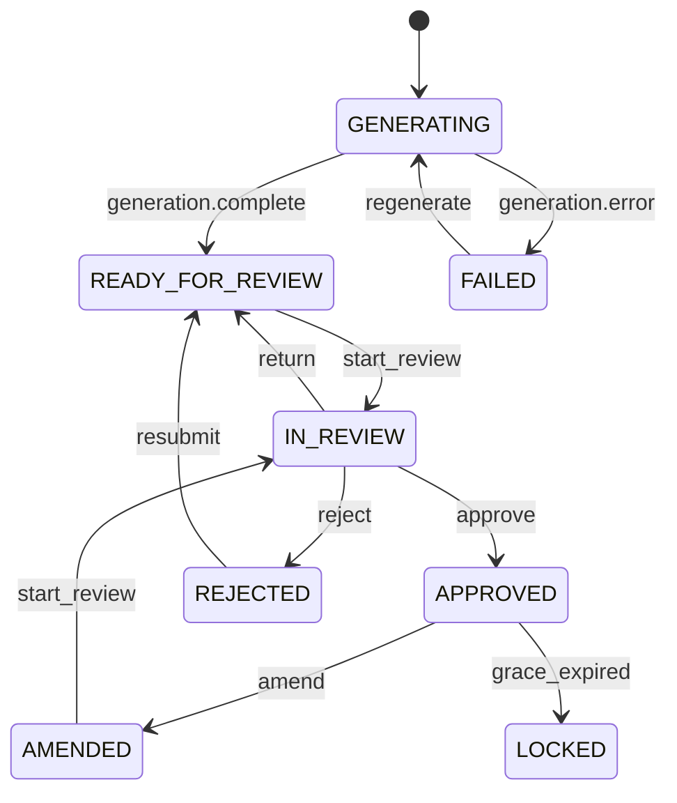

# Note lifecycle state machine

Source of truth: `packages/domain/src/note-machine/transitions.ts` (`TRANSITIONS`, 11 edges).

Pick the diagram style you prefer (image / ASCII / Mermaid).

---

## LucidChart-style



---

## ASCII blocks

```
  GENERATING ──generation.complete──► READY_FOR_REVIEW ──start_review──► IN_REVIEW
       │                                      ▲                              │
       │ generation.error                     │ return                       │
       ▼                                      │                              ├─approve──► APPROVED ──grace_expired──► LOCKED
    FAILED ──regenerate──► GENERATING         │                              │                │
                                              │                              └─reject──► REJECTED
                                              │                                              │
                                              └──────────── resubmit ◄───────────────────────┘
                                                                    (CLINICIAN)

  APPROVED ──amend (24h)──► AMENDED ──start_review──► IN_REVIEW
```

---

## Guard highlights

| Action | Key guards |
|---|---|
| `start_review` | Role `REVIEWER`; assigns actor |
| `approve` | Assigned reviewer; user path needs `mfaVerified` |
| `reject` | Assigned + non-empty `reason` |
| `amend` | CLINICIAN/ADMIN + within 24h grace |
| `grace_expired` | Auto lock after grace |

UI contract: **`getAvailableActions`** drives buttons — no hardcoded status `if` trees for “what can I click.”

---

## Mermaid (optional)



---

## Related code

- `packages/domain/src/note-machine/machine.ts`
- `packages/domain/src/note-machine/transitions.ts`
- `apps/web/src/features/transition-note/ui/NoteActionBar.tsx`
