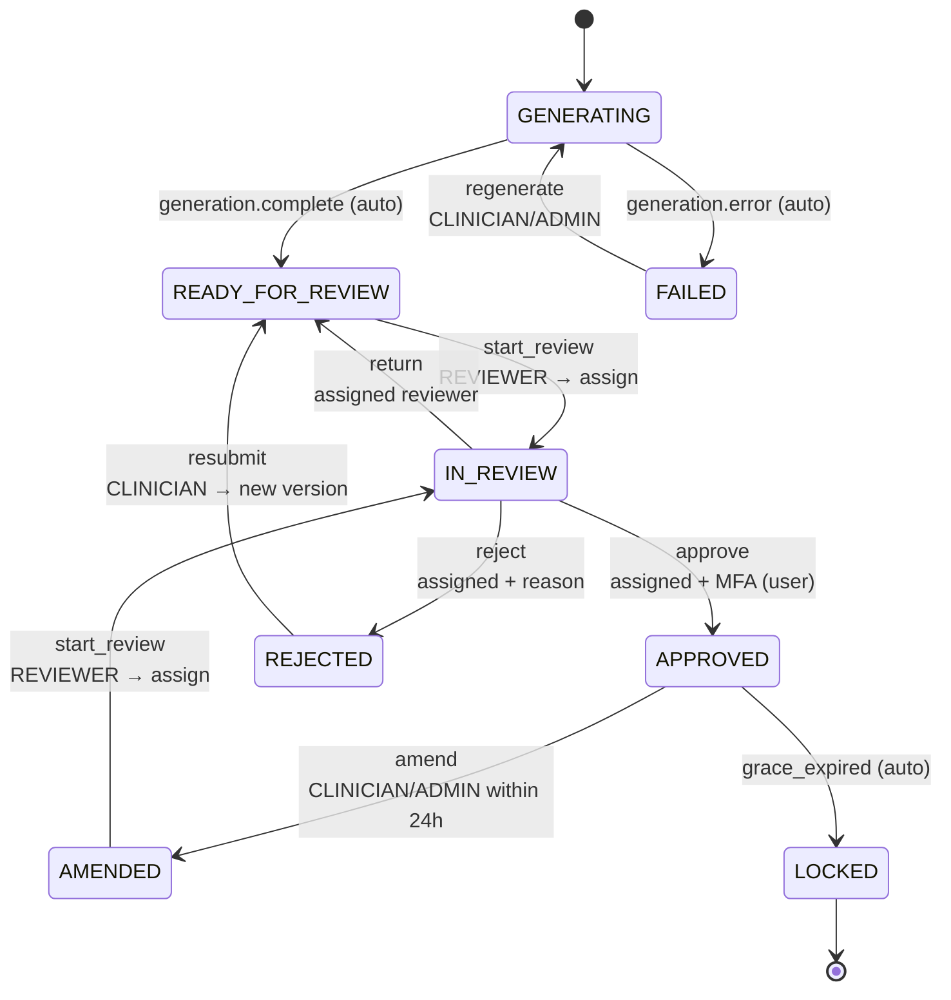

# Note lifecycle state machine

Source of truth: `packages/domain/src/note-machine/transitions.ts` (`TRANSITIONS`, 11 edges).

## Status diagram

## Guard highlights (say these in interview)

| Action | Key guards |
|---|---|
| `start_review` | Role `REVIEWER`; assigns actor as reviewer |
| `approve` | Assigned reviewer; user path requires `mfaVerified` (server source trusts MFA) |
| `reject` | Assigned reviewer + non-empty `reason` |
| `amend` | CLINICIAN/ADMIN + within `AMEND_GRACE_MS` (24h) |
| `grace_expired` | Auto lock after grace; server may force |

## UI contract

- **`getAvailableActions`** drives the action bar — disabled buttons carry human-readable `reason`.
- **`applyServerStatusChange`** routes WS/HTTP authoritative status through the same table with `source: "server"`.
- UI must not hard-code status branches for “what buttons exist.”

## Related code

- `packages/domain/src/note-machine/machine.ts`
- `packages/domain/src/note-machine/transitions.ts`
- `apps/web/src/features/transition-note/ui/NoteActionBar.tsx`
