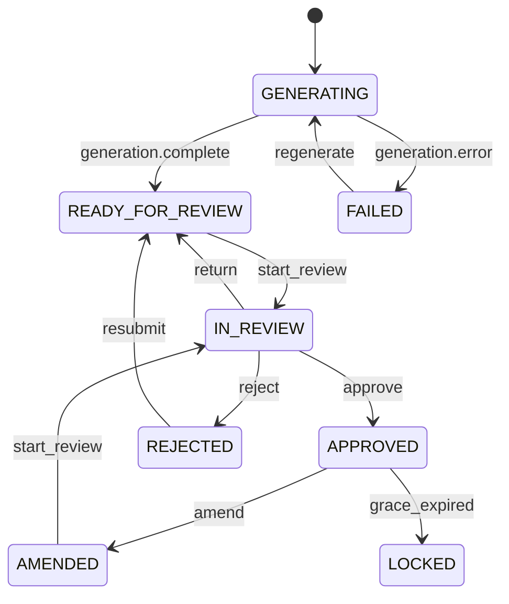
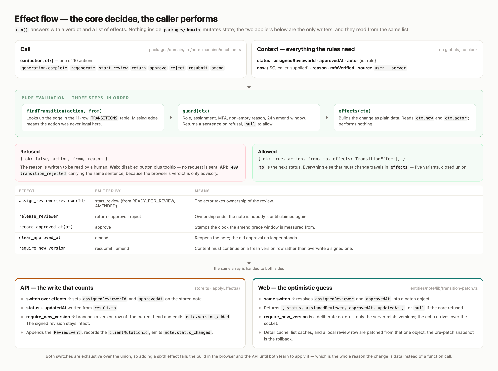

# Note lifecycle state machine

Source of truth: `packages/domain/src/note-machine/transitions.ts` (`TRANSITIONS`, 11 edges).

---

## Guard highlights

| Action | Key guards |
|---|---|
| `start_review` | Role `REVIEWER` or `ADMIN`; assigns actor |
| `approve` | Assigned reviewer (MFA) or `ADMIN` override |
| `reject` | Assigned reviewer or `ADMIN`; non-empty `reason` |
| `return` | Assigned reviewer or `ADMIN` |
| `amend` | CLINICIAN/ADMIN + within 24h grace |
| `resubmit` | CLINICIAN or `ADMIN` |
| `regenerate` | CLINICIAN / ADMIN from `FAILED` → `GENERATING` (API then mock-completes to READY in 5–15s) |

UI contract: **`getAvailableActions`** drives buttons — no hardcoded status `if` trees for “what can I click.”

**Content edit vs workflow:** SOAP edits use **`canEditContent`**. Workflow transitions use guards above. **`ADMIN`** has break-glass access to all user transitions (including approve without MFA and IN_REVIEW actions when not assigned). Other reviewers remain assignment-gated for approve/reject/return.

---

## Mermaid

---

## Effect flow

`can()` returns a verdict plus `TransitionEffect[]`. The core mutates nothing — the API applier and the web optimistic patcher both switch over the same list, so a new effect fails the build on both sides until each learns to apply it.

| Effect | Emitted by | Means |
|---|---|---|
| `assign_reviewer(reviewerId)` | `start_review` | Actor takes ownership |
| `release_reviewer` | `return` · `approve` · `reject` | Ownership ends |
| `record_approved_at(at)` | `approve` | Starts the 24h amend grace clock |
| `clear_approved_at` | `amend` | Old approval no longer stands |
| `require_new_version` | `resubmit` · `amend` | Content continues on a fresh version row; API branches it, web treats it as a no-op |

---

## Related code

- `packages/domain/src/note-machine/machine.ts`
- `packages/domain/src/note-machine/transitions.ts`
- `apps/web/src/features/transition-note/ui/NoteActionBar.tsx`
