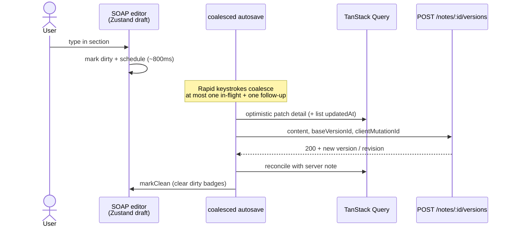

# Sequence — online coalesced autosave (happy path)

Phase 6: draft → coalesce → optimistic Query patch → POST → ack.

## Diagram

## Design notes

- **Mutations never auto-retry** (`query-client.ts`) — callers own idempotency via `clientMutationId` and the offline queue. Blind retries would race coalesced saves.
- Optimistic paint makes typing feel instant; **500** restores the TQ snapshot and surfaces Retry with the **same** mutation id.
- Dirty badges / “Saving…” / “Saved” are derived from draft + in-flight state, not from inventing a second note model.

## Related code

- `apps/web/src/features/autosave-note/model/coalesced-saver.ts`
- `apps/web/src/features/autosave-note/model/use-coalesced-autosave.ts`
