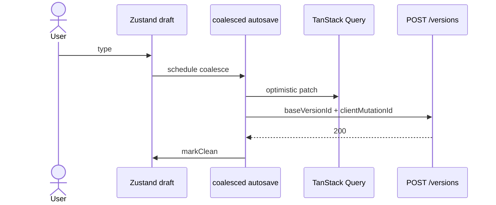

# Sequence — online coalesced autosave (happy path)

---

## Mermaid

---

## Related code

- `apps/web/src/features/autosave-note/model/coalesced-saver.ts`
- `apps/web/src/features/autosave-note/model/use-coalesced-autosave.ts`
