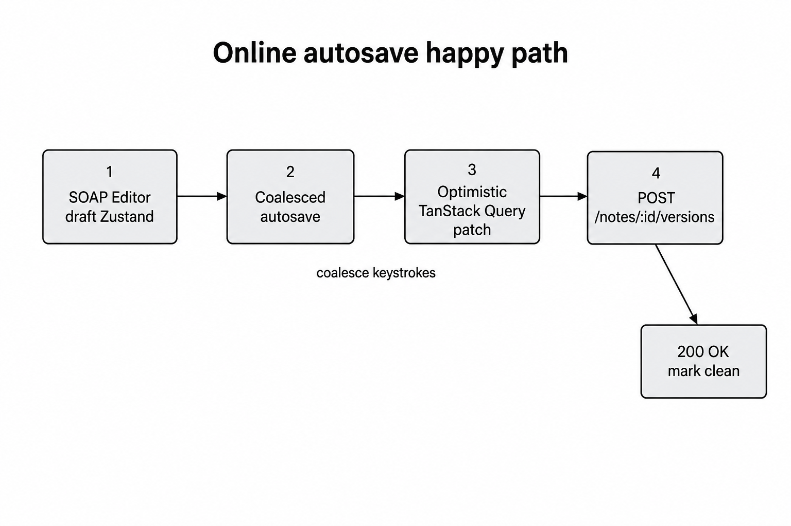
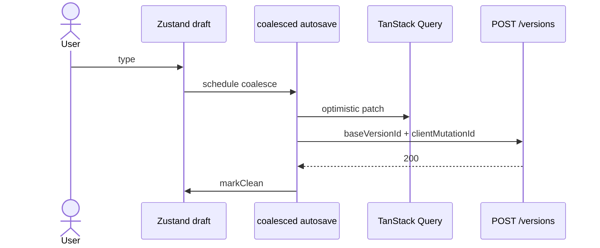

# Sequence — online coalesced autosave (happy path)

Phase 6: draft → coalesce → optimistic Query patch → POST → ack.

Pick the diagram style you prefer (image / ASCII / Mermaid).

---

## LucidChart-style



---

## ASCII blocks

```
[ User types ] → [ Zustand draft dirty ]
        → [ coalesced autosave ~800ms ]
        → [ optimistic TanStack Query patch ]
        → [ POST /notes/:id/versions
              content + baseVersionId + clientMutationId ]
        → [ 200 OK ] → [ markClean / clear dirty badges ]
```

**Notes**

- Mutations never auto-retry — idempotency via `clientMutationId` + offline queue.
- On **500**: restore Query snapshot; Retry reuses the **same** mutation id.

---

## Mermaid (optional)



---

## Related code

- `apps/web/src/features/autosave-note/model/coalesced-saver.ts`
- `apps/web/src/features/autosave-note/model/use-coalesced-autosave.ts`
