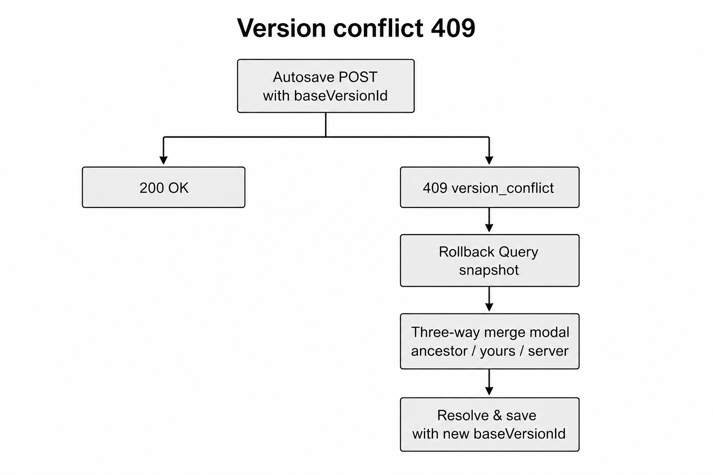
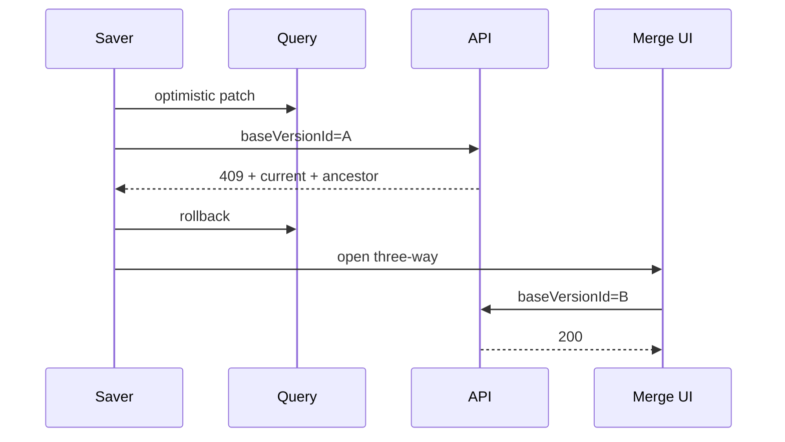

# Sequence — version conflict (409) three-way merge

`POST .../versions` requires `baseVersionId`. Mismatch → `409` with `current` + `commonAncestor`.

Pick the diagram style you prefer (image / ASCII / Mermaid).

---

## LucidChart-style



---

## ASCII blocks

```
[ Autosave / Save ]
        │
        ▼
[ POST baseVersionId = A ]
        │
   ┌────┴────┐
   ▼         ▼
[ 200 OK ]  [ 409 conflict ]
              │
              ▼
        [ Rollback optimistic Query ]
              │
              ▼
        [ Three-way merge modal ]
        [ ancestor | yours | server ]
              │
              ▼
        [ Resolve & save ]
        [ baseVersionId = B (server head) ]
```

| Strategy | Risk |
|---|---|
| Last-write-wins | Silently drops another reviewer’s edits |
| Auto text merge | Unsafe without domain rules |
| **Three-way + human** | Preserves both intents |

---

## Mermaid (optional)



---

## Related code

- `apps/web/src/features/resolve-conflict/`
- `apps/web/src/shared/ui/word-diff.tsx`
