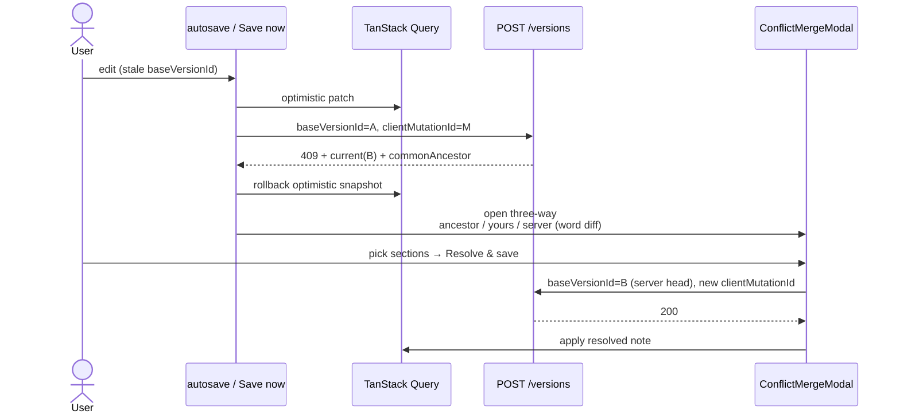

# Sequence — version conflict (409) three-way merge

Optimistic concurrency: `POST .../versions` requires `baseVersionId`. Mismatch → `409 version_conflict` with `current` + `commonAncestor` content.

## Diagram

## Why three-way (not LWW / silent overwrite)

| Strategy | Risk in clinical notes |
|---|---|
| Last-write-wins | Silently drops another reviewer’s SOAP edits |
| Auto text merge | Unsafe without domain-aware merge |
| **Three-way + human resolve** | Preserves both intents; ancestor anchors the diff |

## Idempotency

- Retry after **5xx** reuses the same `clientMutationId`.
- Resolve after **409** retargets `baseVersionId` to server head and typically uses a **new** mutation id for the merge save (`merge_…`).

## Related code

- `apps/web/src/features/resolve-conflict/`
- `apps/web/src/shared/ui/word-diff.tsx`
- API `X-Force-Conflict` / chaos for demos
