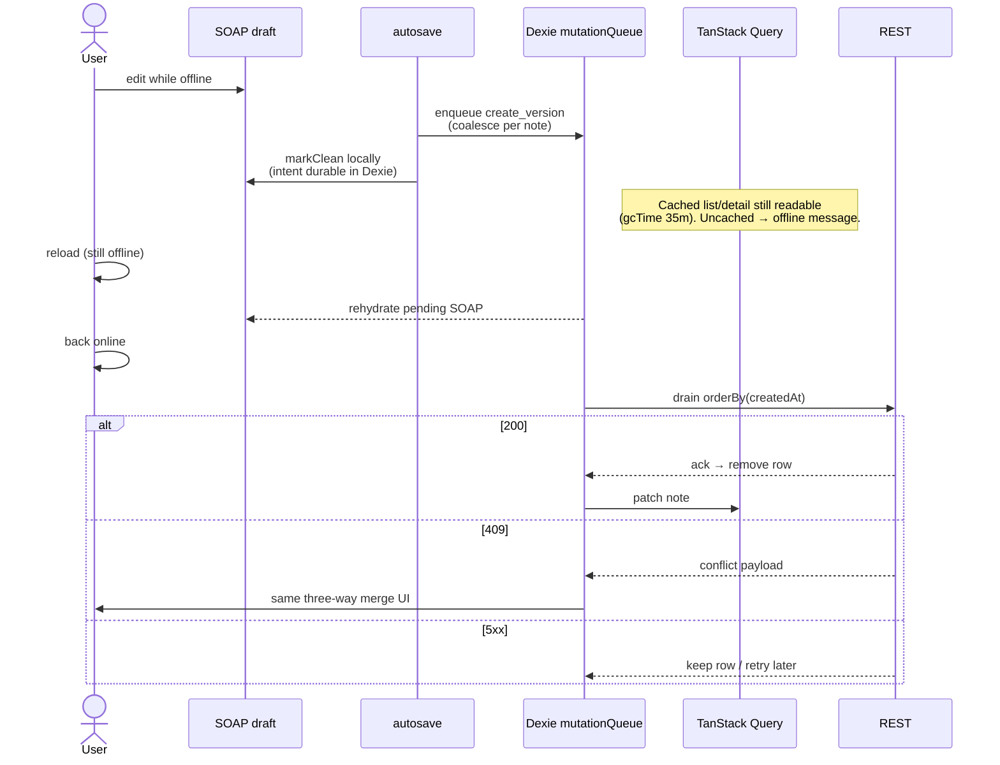

# Sequence — offline mutation outbox (Dexie)

Phase 8: while offline, intents enqueue to IndexedDB; on reconnect, drain FIFO. Dexie holds **client intent**, not a full notes replica.

## Diagram

## Rules of the queue

1. **Coalesce** pending `create_version` rows per note so rapid offline typing does not enqueue N near-duplicates.
2. **Transitions** (`start_review`, etc.) are also queueable intents.
3. Connectivity banner + header badge follow `navigator.onLine`; WS disconnects while offline.
4. Production hardening called out in README: queue may hold clinical text — encrypt-at-rest in real deployments.

## Related code

- `apps/web/src/features/offline-queue/model/mutation-queue.ts`
- `apps/web/src/features/offline-queue/model/drain.ts`
- `apps/web/src/shared/db/`
