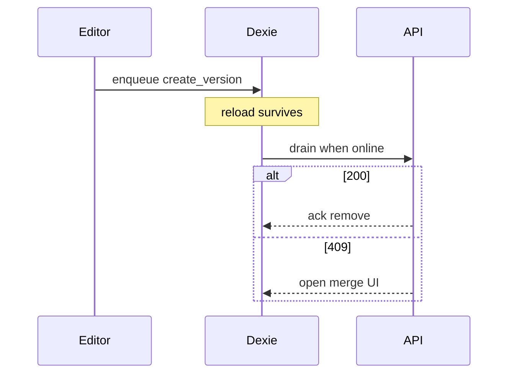

# Sequence — offline mutation outbox (Dexie)

Dexie holds **client intent**, not a full notes replica.

Pick the diagram style you prefer (image / ASCII / Mermaid).

---

## LucidChart-style


---

## ASCII blocks

```
OFFLINE
  [ Edit SOAP ] → [ Enqueue Dexie mutationQueue ]
                → [ markClean locally ]
                → [ cached Query still readable ]

  [ Reload ] → [ Rehydrate pending SOAP from Dexie ]

ONLINE
  [ Drain FIFO orderBy(createdAt) ] → [ REST ]
        │
   ┌────┼────────────────┬──────────────────┐
   ▼    ▼                ▼                  ▼
 [200] [409 / 4xx SOAP] [transition 4xx] [5xx keep / retry]
 remove  merge modal     toast + drop     keep row
         + toast
```

**Rules:** coalesce `create_version` per note · transitions also queueable · uncached detail shows offline message (not “not found”) · terminal transition 4xx (e.g. offline `start_review` after peer claimed) are discarded with a toast · discarded/conflicted SOAP opens the same 3-way merge modal so offline edits are not silently lost.

---

## Mermaid (optional)



---

## Related code

- `apps/web/src/features/offline-queue/model/mutation-queue.ts`
- `apps/web/src/features/offline-queue/model/drain.ts`
