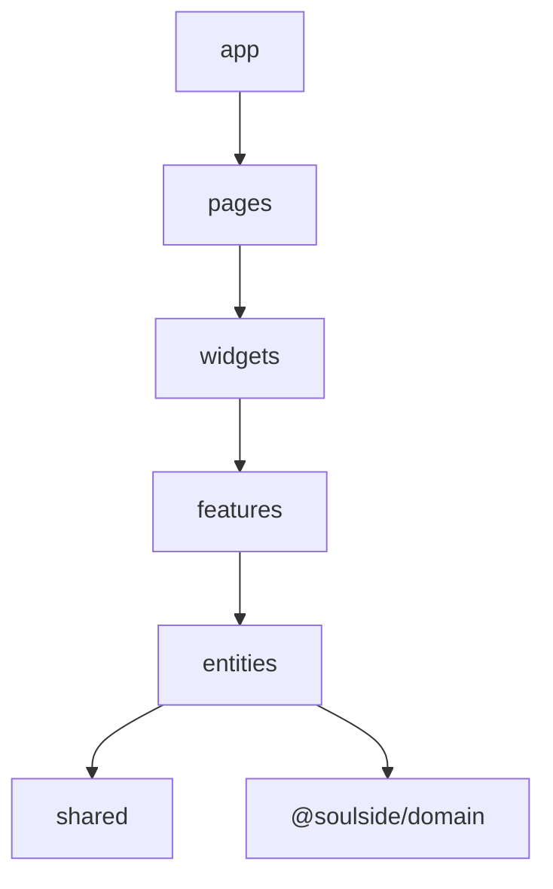

# Feature-Sliced Design — dependency map

Import rule: layers only depend **downward**  
`app` → `pages` → `widgets` → `features` → `entities` → `shared`.

`@soulside/domain` sits beside the web app (imported by entities / API).

---

**Illegal:** `entities` → `features` · `shared` → `features` · upward imports.

---

## Mermaid 

---

## Related

- https://feature-sliced.design/docs/reference/layers
- Tree: `apps/web/src/`
