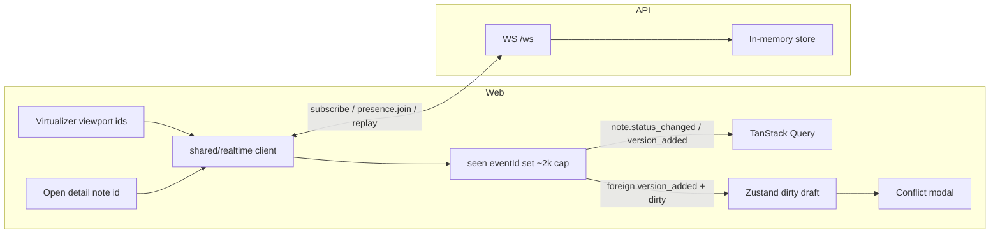

# Real-time reconcile — HTTP ack vs WebSocket

Phase 7: app-wide socket; viewport + detail subscriptions; idempotent patches into TanStack Query.

## Architecture



## Race: HTTP ack and WS may arrive in either order

```mermaid
sequenceDiagram
  participant TabA
  participant API
  participant WS as WebSocket fanout
  participant TabB

  TabA->>API: POST transition / version
  par Either order
    API-->>TabA: HTTP 200 ack
    API->>WS: note.* event
    WS-->>TabA: same semantic update
    WS-->>TabB: note.* event
  end
  Note over TabA,TabB: Both paths patch TQ idempotently<br/>dedupe by eventId; HTTP path does not double-apply
```

## Behaviors to defend in interview

| Concern | Approach |
|---|---|
| Fan-out cost | Subscribe only viewport rows + open detail — not one socket per row |
| Missed events | Reconnect with exponential backoff + jitter; `lastEventId` replay |
| Memory | Cap seen `eventId` set (~2k) |
| Local dirty vs remote edit | Foreign `version_added` opens the same three-way merge UI |
| Presence | `presence.join` on detail; avatars from store |

## Related code

- `apps/web/src/shared/realtime/`
- `apps/web/src/entities/note/lib/apply-realtime-event.ts`
- `apps/web/src/features/realtime-sync/`
