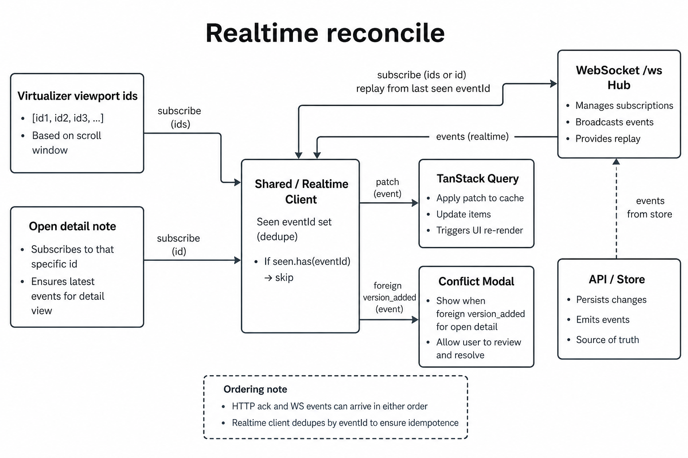
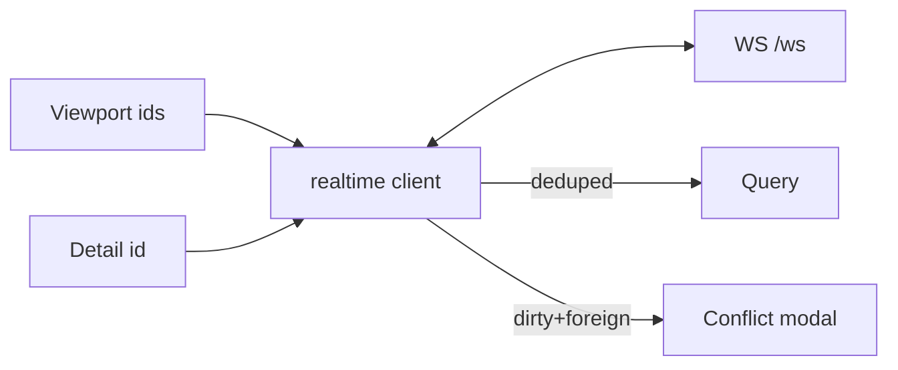

# Real-time reconcile — HTTP ack vs WebSocket

Viewport + detail subscriptions; idempotent patches into TanStack Query.

Pick the diagram style you prefer (image / ASCII / Mermaid).

---

## LucidChart-style



---

## ASCII blocks

```
┌─────────────────┐     ┌──────────────────────┐     ┌─────────────┐
│ Virtualizer ids │────►│ shared/realtime      │◄───►│ WS /ws hub  │
│ Open detail id  │     │ eventId dedupe (~2k) │     │ API store   │
└─────────────────┘     └──────────┬───────────┘     └─────────────┘
                                   │
                    ┌──────────────┼──────────────┐
                    ▼              ▼              ▼
            [ TanStack Query ] [ Conflict modal ] [ Presence ]
              status/version    if dirty + foreign
              patches           version_added
```

**Race:** HTTP 200 ack and WS `note.*` may arrive in **either order** — both paths must be idempotent (`eventId` dedupe).

**Demo:** Demo FAB → **Resend last WS event (duplicate eventId)** rebroadcasts the last logged event with the same id and `demoDuplicate: true`. Every subscribed tab toasts **WS duplicate dropped** and skips a second patch; routine subscribe/replay dedupe (no flag) stays silent.

| Concern | Approach |
|---|---|
| Fan-out | Subscribe viewport + detail only |
| Missed events | Backoff + `lastEventId` replay |
| Local dirty vs remote | Same three-way merge UI |
| At-least-once demo | `/api/dev/realtime/duplicate` + `seenEventIds` |
| Presence | Join on detail; unsubscribe on scroll does **not** leave presence |

---

## Mermaid (optional)



---

## Related code

- `apps/web/src/shared/realtime/`
- `apps/web/src/entities/note/lib/apply-realtime-event.ts`
- `apps/web/src/features/realtime-sync/`
