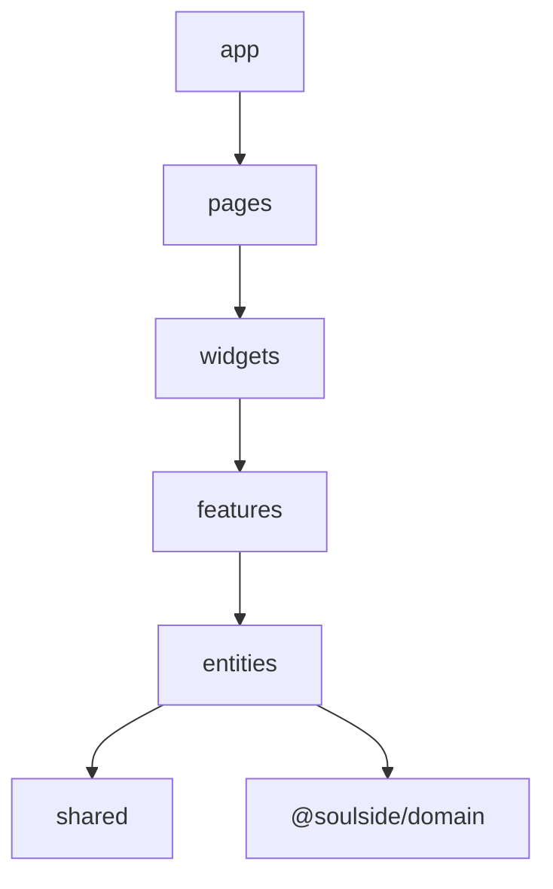

# Feature-Sliced Design — dependency map

Import rule: layers only depend **downward**  
`app` → `pages` → `widgets` → `features` → `entities` → `shared`.

`@soulside/domain` sits beside the web app (imported by entities / API).

**Illegal:** `entities` → `features` · `shared` → `features` · upward imports.

Same-layer imports (for example one feature importing another) are allowed here — the docs forbid upward edges, not cross-slice coupling.

## Enforcement

`apps/web/eslint.config.js` runs `eslint-plugin-boundaries` against that table. Aliases (`@features`, `@entities`, …) resolve through `tsconfig.json`.

```bash
pnpm lint
```

---

## Mermaid



---

## Related

- https://feature-sliced.design/docs/reference/layers
- Tree: `apps/web/src/`
- Config: `apps/web/eslint.config.js`
