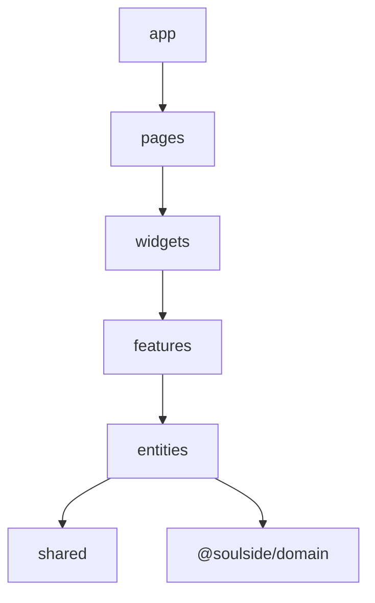

# Feature-Sliced Design — dependency map

Import rule: layers only depend **downward**  
`app` → `pages` → `widgets` → `features` → `entities` → `shared`.

Within a sliced layer (`pages`, `widgets`, `features`, `entities`), a module may only import **its own slice** or a lower layer. Sibling slices are illegal.

`app` and `shared` use segments (not slices); cross-segment imports inside those layers are fine.

`@soulside/domain` sits beside the web app (imported by entities / API).

**Illegal:** `features/a` → `features/b` · `entities` → `features` · `shared` → `features` · any upward import.

## Enforcement

`apps/web/eslint.config.js` runs `eslint-plugin-boundaries` with same-slice capture matching. Aliases (`@features`, `@entities`, …) resolve through `tsconfig.json`.

```bash
pnpm lint
```

Shared primitives used by several features live under `shared/` (for example `shared/offline`, `shared/prefs`, `shared/devtools-events`) so features never import each other for infrastructure.

---

## Mermaid



---

## Related

- https://feature-sliced.design/docs/reference/layers
- Tree: `apps/web/src/`
- Config: `apps/web/eslint.config.js`
