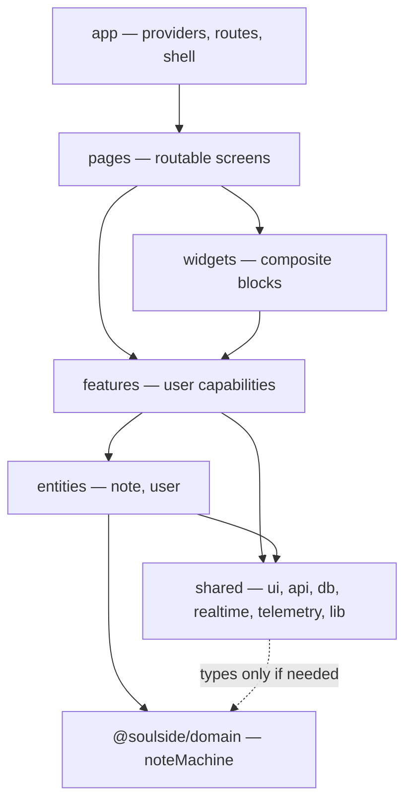

# Feature-Sliced Design — dependency map

Import rule: layers only depend **downward**  
`app` → `pages` → `widgets` → `features` → `entities` → `shared`.

Domain package sits **beside** the web app and is imported by entities / API — not a React layer.

## Diagram

## Slice examples in this repo

| Layer | Examples |
|---|---|
| `features/` | `autosave-note`, `resolve-conflict`, `offline-queue`, `realtime-sync`, `transition-note`, `filter-notes` |
| `entities/` | `note` queries + realtime apply helpers |
| `shared/` | `api`, `db`, `realtime`, `telemetry`, `ui` |
| `pages/` | Notes list, note detail, lab, admin |

## Illegal imports (call these out)

- `entities` importing `features` or `pages`
- `shared` importing `features` (shared must stay capability-agnostic)
- Cross-feature deep imports that create cycles — prefer public `index.ts` of a slice

## Why FSD for a take-home

- Makes the **capability boundaries** obvious in interview walkthroughs.
- Matches the assignment’s architecture-over-polish posture.
- Cost: more folders; acceptable because slices map 1:1 to Phase features.

## Related

- Official layers: https://feature-sliced.design/docs/reference/layers
- Tree: `apps/web/src/`
