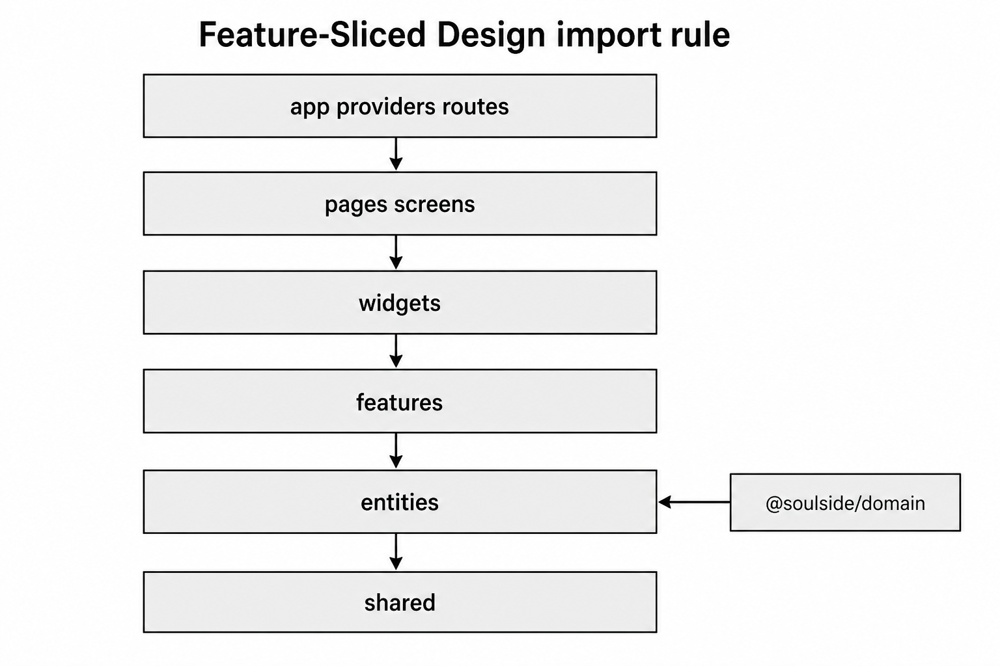
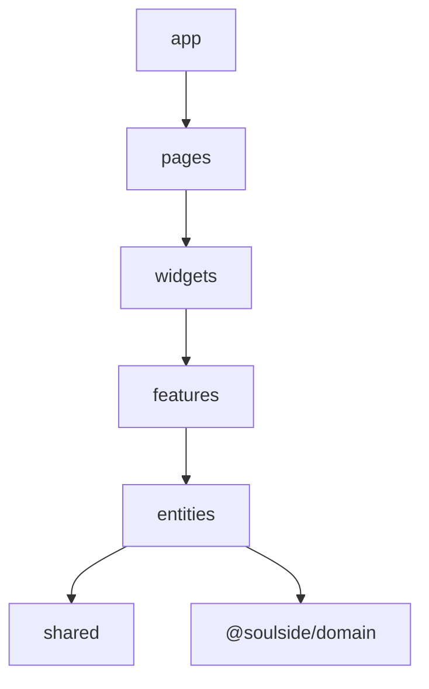

# Feature-Sliced Design — dependency map

Import rule: layers only depend **downward**  
`app` → `pages` → `widgets` → `features` → `entities` → `shared`.

`@soulside/domain` sits beside the web app (imported by entities / API).

Pick the diagram style you prefer (image / ASCII / Mermaid).

---

## LucidChart-style



---

## ASCII blocks

```
┌─────────────────────────────────────┐
│ app — providers, routes, shell      │
└──────────────────┬──────────────────┘
                   ▼
┌─────────────────────────────────────┐
│ pages — routable screens            │
└──────────────────┬──────────────────┘
                   ▼
┌─────────────────────────────────────┐
│ widgets — composite UI blocks       │
└──────────────────┬──────────────────┘
                   ▼
┌─────────────────────────────────────┐
│ features — user capabilities        │
│ autosave, conflict, offline, …      │
└──────────────────┬──────────────────┘
                   ▼
┌─────────────────────────────────────┐
│ entities — note, user               │──► @soulside/domain
└──────────────────┬──────────────────┘
                   ▼
┌─────────────────────────────────────┐
│ shared — api, db, realtime, ui      │
└─────────────────────────────────────┘
```

**Illegal:** `entities` → `features` · `shared` → `features` · upward imports.

---

## Mermaid (optional)



---

## Related

- https://feature-sliced.design/docs/reference/layers
- Tree: `apps/web/src/`
