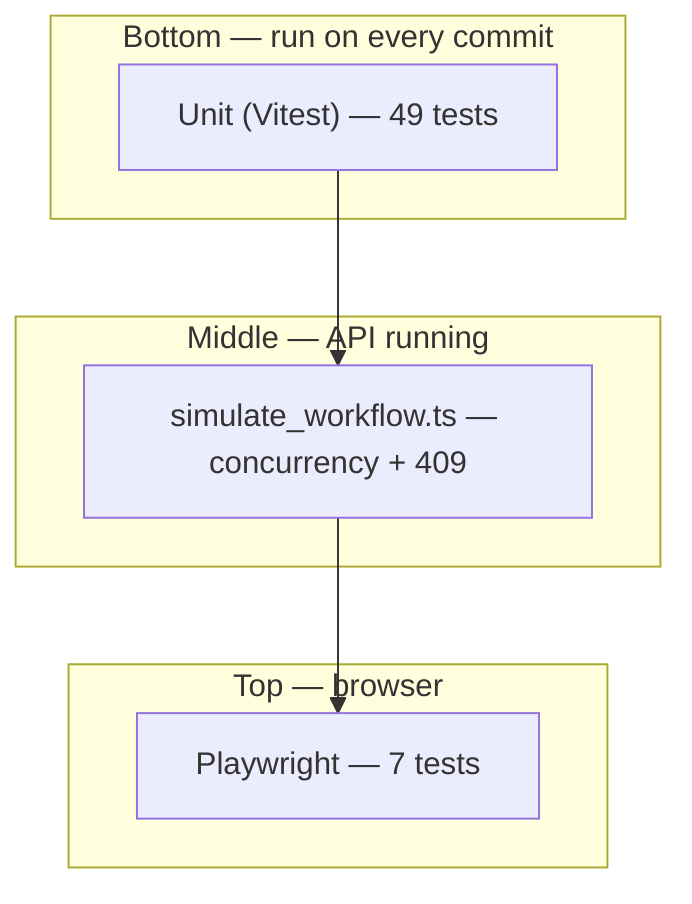

# Testing strategy & performance

## Testing pyramid (how the pieces fit)

Think of tests as a **pyramid**: many fast tests at the bottom, fewer slow tests at the top.



| Layer | Speed | Proves | Does *not* prove |
|---|---|---|---|
| **Unit** | ~1s | Rules & algorithms in isolation | CSS, routing, real network timing |
| **API sim** | ~10s | Server + domain under concurrency | React components, a11y |
| **E2E** | ~10s | Full user journey in browser | Every edge case (too slow) |

**Rule of thumb:** put **business rules** in unit tests (state machine), **protocol behavior** in API sim (409, WS order), and **critical UI wiring** in E2E (modals, actor switcher, autosave).

---

## Unit tests (`pnpm test`)

### Domain — `packages/domain`

`machine.test.ts` (40 cases) is the **contract** for workflow and content edit:

- All 11 `TRANSITIONS` edges
- **ADMIN break-glass:** `start_review`, `return`, `approve` (no MFA), `reject`, `resubmit` without assignment
- **Reviewer assignment:** non-assigned reviewers blocked on IN_REVIEW actions
- `canEditContent`: assigned reviewer + ADMIN in `IN_REVIEW`; clinician on REJECTED/AMENDED
- `getAvailableActions` drives the action bar — tests mirror UI enable/disable

### Web — `apps/web`

| Test | Invariant |
|---|---|
| `coalesced-saver.test.ts` | Autosave scheduling under rapid edits |
| `mutation-queue.test.ts` | Offline queue coalesce + FIFO order |
| `drain.test.ts` | Terminal transition toast; SOAP conflict opens merge modal; 5xx kept |
| `apply-realtime-event.test.ts` | WS dedupe + silent foreign version toast vs dirty merge |
| `redact.test.ts` | Telemetry PII stripping |

---

## API simulation (`pnpm simulate`)

Assignment baseline (PDF): **three reviewers**, concurrent claim of READY notes, edit, approve/reject.

### Happy path

1. `POST /api/dev/seed` (5000 notes)
2. Enable chaos (latency, 3% 500, 2% conflict)
3. `Promise.all([reviewerLoop(dr_a), dr_b, dr_c])` — each tries 20 iterations
4. `claimReadyNote` handles concurrent `start_review` races
5. Saves retry 409 by merging onto server `current` head

### Extra scenarios (`pnpm simulate:scenarios`)

| Scenario | Asserts |
|---|---|
| **Overlapping editors** | Stale `baseVersionId` → `409` + `commonAncestor` |
| **Reject + admin + resubmit** | ADMIN edits REJECTED note; clinician stale save → `409` **before** resubmit |
| **Realtime before ack** | WS `IN_REVIEW` event may beat HTTP response |
| **Burst 500 GETs** | API survives load |

### Sim vs E2E

| Concern | Sim | E2E |
|---|---|---|
| Three reviewers racing | Yes | No |
| 409 payload shape | Yes | Conflict modal only |
| Reject modal UX | No | Yes |
| Actor avatar menu | No | Yes |
| Offline queue | No (not yet) | No (not yet) |

---

## E2E (`pnpm test:e2e`)

Playwright config: `workers: 1` (shared in-memory API), `CHAOS=0`, auto-starts API + Vite.

### Layout

```
e2e/
  helpers.ts           # actAs, claimReadyNote, armForceConflict, …
  smoke.spec.ts        # Golden path — run first in CI
  workflows.spec.ts    # Reject, conflict merge
  access-control.spec.ts  # Roles, assignment, URL filters
```

### Test catalog

| Spec | Scenario | Why it matters |
|---|---|---|
| `smoke` | READY → review → edit → approve | Proves the assignment’s core reviewer loop |
| `workflows` | Reject with reason | Modal + `REJECTED` + SOAP locked |
| `workflows` | Demo force conflict → Resolve & save | Three-way merge UI (assignment requirement) |
| `access-control` | Auditor read-only | `READONLY_AUDITOR` cannot edit |
| `access-control` | Dr. B on Dr. A’s note | Assignment gate copy in UI |
| `access-control` | Admin approves assigned note | ADMIN break-glass visible to user |
| `access-control` | `?status=READY_FOR_REVIEW` deep link | URL-persisted filters |

### E2E tips (learning)

1. **Prefer roles over CSS** — `getByRole("button", { name: "Approve" })` survives class renames.
2. **Use `expect.poll`** for async UI (autosave clearing “Dirty” badges).
3. **Accept dialogs once** — Approve uses `window.confirm` as mock MFA.
4. **Navigate before `actAs`** — header avatar only exists after a page load.
5. **Don’t parallelize** against one mock API — races on the same note pool.

### Good next E2E additions (not implemented)

- Offline: DevTools offline → edit → queue → online drain
- Two browser contexts on same note (presence + live status)
- Bulk “Start review” on selected rows

---

## Performance (no React Compiler)

React Compiler is **not** wired in this project. Optimizations are explicit:

| Layer | Pattern |
|---|---|
| Bundle | `lazy()` routes + deferred conflict/telemetry chunks |
| List | TanStack Virtual + infinite query (cursor pages) |
| Server cache | Query `staleTime` / `gcTime` / `offlineFirst` |
| Network | WS scoped to viewport + detail; autosave coalesce |
| Memory | Realtime `eventId` cap; virtualizer unmounts off-screen rows |

Enable React Compiler later via `babel-plugin-react-compiler` on the Vite React plugin — re-run `pnpm test:e2e` after.

---

## Related

- [`phases.md`](./phases.md) — Phase 11 manual verification
- [`03-note-lifecycle-state-machine.md`](./03-note-lifecycle-state-machine.md) — ADMIN guards
- [`09-adr-index.md`](./09-adr-index.md) — WS subscription scope ADR
