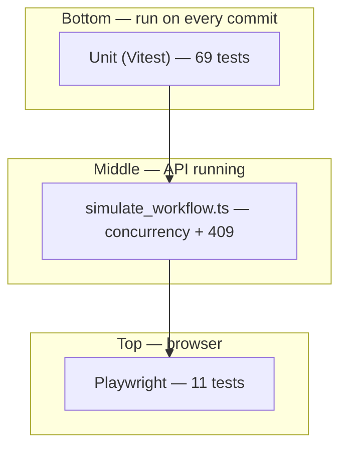

# Testing strategy & performance

## Testing pyramid (how the pieces fit)

Think of tests as a **pyramid**: many fast tests at the bottom, fewer slow tests at the top.



| Layer | Speed | Proves | Does *not* prove |
|---|---|---|---|
| **Unit** | ~1s | Rules & algorithms in isolation | CSS, routing, real network timing |
| **API sim** | ~10s | Server + domain under concurrency | React components, a11y |
| **E2E** | ~10s | Full user journey in browser | Every edge case (too slow) |

**Rule of thumb:** put **business rules** in unit tests (state machine), **protocol behavior** in API sim (409, WS order), and **critical UI wiring** in E2E (modals, actor switcher, autosave).

---

## Unit tests (`pnpm test`)

### Domain — `packages/domain`

`machine.test.ts` (44 cases) is the **contract** for workflow and content edit:

- All `TRANSITIONS` edges
- **ADMIN break-glass:** `start_review`, `return`, `approve` (no MFA), `reject`, `resubmit` without assignment
- **Reviewer assignment:** non-assigned reviewers blocked on IN_REVIEW actions
- `canEditContent`: assigned reviewer + ADMIN in `IN_REVIEW`; clinician on REJECTED/AMENDED
- `getAvailableActions` / `getLifecycleBanner` drive the action bar and banners — tests mirror UI enable/disable

### Web — `apps/web` (25 cases)

| Test | Invariant |
|---|---|
| `optimistic-transition.test.ts` | Local ReviewEvent mint + HTTP/WS reconcile |
| `coalesced-saver.test.ts` | Autosave scheduling under rapid edits |
| `editor-draft-store.test.ts` | Dirty tracking / hydrate |
| `mutation-queue.test.ts` | Offline queue coalesce + FIFO order |
| `drain.test.ts` | Terminal transition toast; SOAP conflict opens merge modal; 5xx kept |
| `apply-realtime-event.test.ts` | WS dedupe + silent foreign version toast vs dirty merge |
| `redact.test.ts` | Telemetry PII stripping |

---

## API simulation (`pnpm simulate`)

Assignment baseline (PDF): **three reviewers**, concurrent claim of READY notes, edit, approve/reject.

Notes API calls mint a demo Bearer via `POST /api/dev/token` (same auth surface as the SPA).

### Happy path

1. `POST /api/dev/seed` (5000 notes)
2. Enable chaos (latency, 3% 500, 2% conflict)
3. `Promise.all([reviewerLoop(dr_a), dr_b, dr_c])` — each tries 20 iterations
4. `claimReadyNote` handles concurrent `start_review` races
5. Saves retry 409 by merging onto server `current` head

### Extra scenarios (`pnpm simulate:scenarios`)

| Scenario | Asserts |
|---|---|
| **Overlapping editors** | Stale `baseVersionId` → `409` + `commonAncestor` |
| **Reject + admin + resubmit** | ADMIN edits REJECTED note; clinician stale save → `409` **before** resubmit |
| **Realtime before ack** | WS `IN_REVIEW` event may beat HTTP response |
| **Burst 500 GETs** | API survives load |

### Sim vs E2E

| Concern | Sim | E2E |
|---|---|---|
| Three reviewers racing | Yes | No |
| 409 payload shape | Yes | Conflict modal + two-tab loser draft |
| Reject modal UX | No | Yes |
| Actor avatar menu + JWT mint | No | Yes (`actAs` waits for remint) |
| Offline queue | Unit drain/coalesce | Yes (`offline.spec.ts`) |
| WS before HTTP ack | Yes (sim) | Yes (`realtime.spec.ts`) |

### Assignment “build your own” matrix

| Scenario | Sim / unit | E2E |
|---|---|---|
| Overlapping editors, no lost work | API 409 + merge | Two contexts; loser text in merge modal |
| Drop mid-save / queue / reconnect (~20 min) | Dexie unit + `gcTime` 35m | Offline → SPA remount → online drain (no literal sleep; no SW so hard reload offline can’t boot Vite) |
| `status_changed` before HTTP ack | `scenarioRealtimeBeforeAck` | Hold transition response; Approve paints first |
| REJECTED → admin supersede → resubmit | Sim scenario | Not yet (API-proven) |
| 500 notes / no leak | 500 GETs | 25 sequential opens + Live badge (CI smoke; not heap profiling) |

---

## E2E (`pnpm test:e2e`)

Playwright config: `workers: 1` (shared in-memory API), `CHAOS=0`, auto-starts API + Vite.

### Layout

```
e2e/
  helpers.ts              # actAs, claimReadyNote, setBrowserOffline, …
  smoke.spec.ts           # Golden path — run first in CI
  workflows.spec.ts       # Reject, conflict merge
  access-control.spec.ts  # Roles, assignment, URL filters
  concurrency.spec.ts     # Two-tab overlapping edit
  offline.spec.ts         # Queue + remount + drain
  realtime.spec.ts        # WS paints before held HTTP ack
  session-soak.spec.ts    # Open many notes in one session
```

### Test catalog

| Spec | Scenario | Why it matters |
|---|---|---|
| `smoke` | READY → review → edit → approve | Proves the assignment’s core reviewer loop |
| `workflows` | Reject with reason | Modal + `REJECTED` + SOAP locked |
| `workflows` | Demo force conflict → Resolve & save | Three-way merge UI (assignment requirement) |
| `access-control` | Auditor read-only | `READONLY_AUDITOR` cannot edit |
| `access-control` | Dr. B on Dr. A’s note | Assignment gate copy in UI |
| `access-control` | Admin approves assigned note | ADMIN break-glass visible to user |
| `access-control` | `?status=READY_FOR_REVIEW` deep link | URL-persisted filters |
| `concurrency` | Two tabs overlapping SOAP | Loser’s draft survives in merge modal |
| `offline` | Offline edits → remount → drain | Dexie queue + no silent wipe |
| `realtime` | Hold HTTP transition ack | Status from WS before POST body |
| `session-soak` | Open 25 notes | Navigation / badge stay healthy |

### E2E tips (learning)

1. **Prefer roles over CSS** — `getByRole("button", { name: "Approve" })` survives class renames.
2. **Use `expect.poll`** for async UI (autosave clearing “Dirty” badges).
3. **Accept dialogs once** — Approve uses `window.confirm` as mock MFA.
4. **Navigate before `actAs`** — header avatar only exists after a page load; wait for aria-label after JWT remint.
5. **Don’t parallelize** against one mock API — races on the same note pool.

### Still useful later (not required for take-home)

- Presence avatars across two contexts
- Reject → admin edit → clinician resubmit full UI
- Heap / listener counts for a true 500-note soak
- Sticky fail-next rollback demo

---

## Performance (no React Compiler)

React Compiler is **not** wired in this project. Optimizations are explicit:

| Layer | Pattern |
|---|---|
| Bundle | `lazy()` routes + deferred conflict/telemetry chunks |
| List | TanStack Virtual + infinite query (`maxPages` sliding window) |
| Server cache | Query `staleTime` / `gcTime` / `offlineFirst` |
| Network | WS scoped to viewport + detail; autosave coalesce |
| Memory | List window ≤ `NOTES_LIST_MAX_PAGES`; realtime `eventId` cap; virtualizer unmounts off-screen rows |

Enable React Compiler later via `babel-plugin-react-compiler` on the Vite React plugin — re-run `pnpm test:e2e` after.

---

## Related

- [`phases.md`](./phases.md) — Phase 11 / 14 manual verification
- [`03-note-lifecycle-state-machine.md`](./03-note-lifecycle-state-machine.md) — ADMIN guards
- [`09-adr-index.md`](./09-adr-index.md) — JWT, sticky fail, WS subscription ADRs
